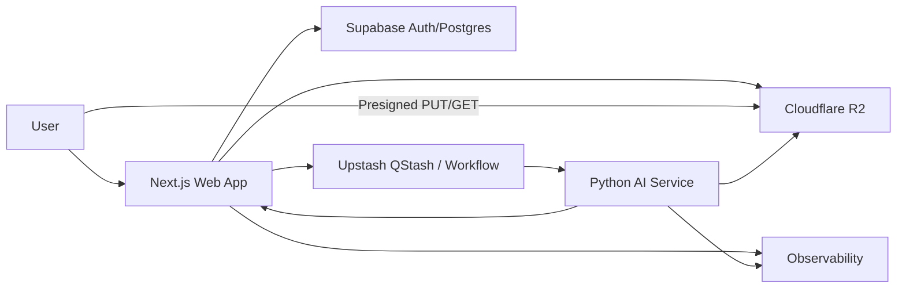
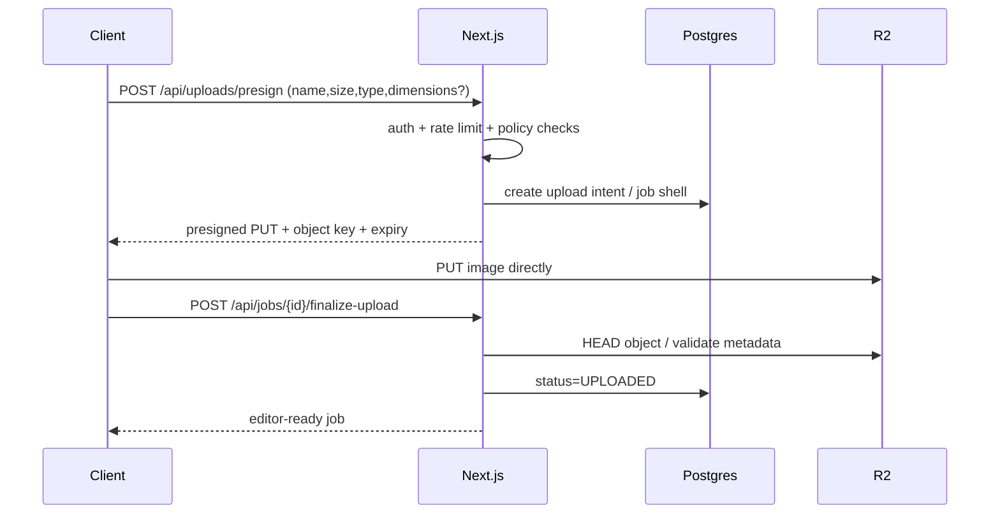
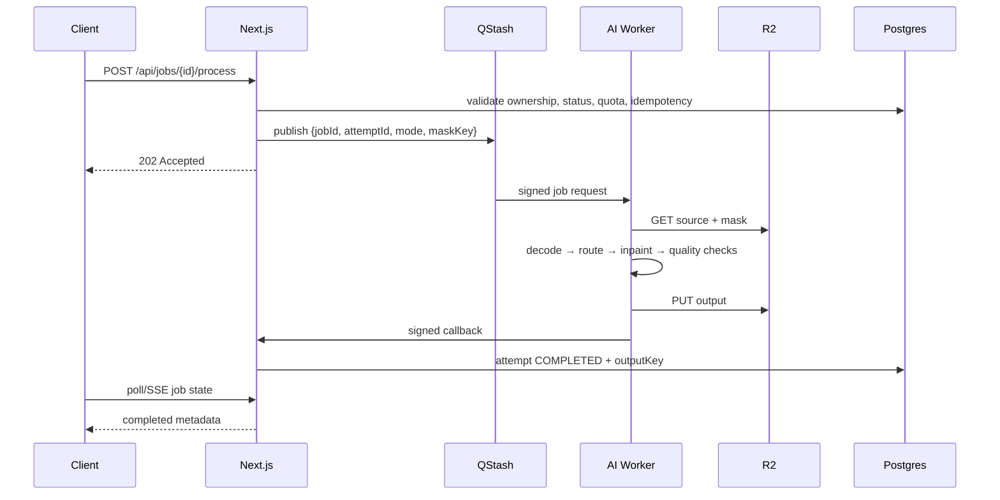
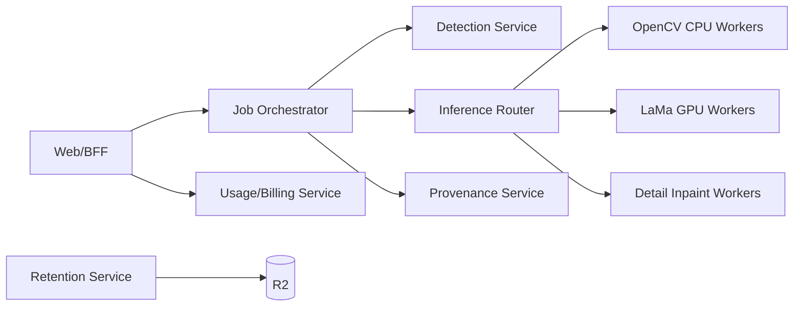
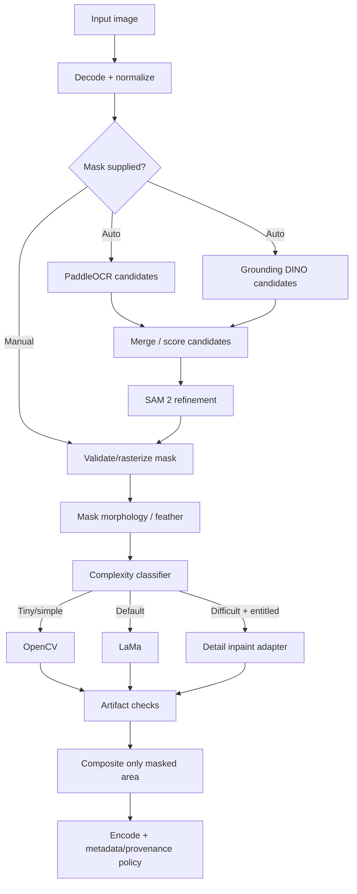
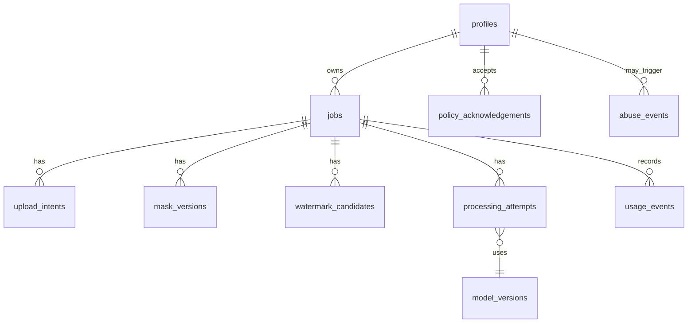

# Watermark Removal Platform — Complete Project Specification

**Version:** 1.0  
**Prepared:** 2026-09-08

This file consolidates the complete documentation bundle. The split files are preferable for implementation and maintenance.

---

# 00 — Master Project Blueprint

**Project:** Watermark Removal Platform (working name: CleanMark)  
**Document version:** 1.0  
**Prepared:** 2026-09-08  
**Status:** Architecture / implementation blueprint  

> **Purpose:** Single executive specification defining the product, architecture, boundaries and build strategy.

> Product boundary: the platform is designed for images the user owns or is authorized to modify. It does not intentionally remove hidden provenance, C2PA Content Credentials, or other non-visible rights-management information.

---

## Executive summary

The product is an **authorized visual-cleanup web application** focused on removing visible watermarks and overlays from images. The first release should optimize for reliability and user control rather than claiming one-click perfection. A user can upload an image, confirm authorization, automatically or manually create a removal mask, run an inpainting engine, compare before/after, correct the mask if necessary, and export the result.

The project is feasible because the difficult computer-vision tasks already have strong open-source building blocks. The engineering challenge is less about inventing a novel model on day one and more about **mask quality, model routing, image fidelity, latency, GPU economics, abuse resistance and a polished editor**.

## Product thesis

Users usually do not need a complicated Photoshop workflow; they need a narrow flow:

```text
Upload → Find mark → Correct selection → Remove → Compare → Export
```

The app wins when this takes seconds, preserves untouched pixels, works well on text/logo/repeating overlays, and gives users a manual escape hatch when automatic detection is uncertain.

## Product boundaries

### Included

- Visible text watermark removal from authorized images.
- Visible logo/brand-overlay removal from authorized images.
- Visible overlays on AI-generated images when the user is permitted to edit the image.
- Manual brush/lasso/rectangle masking.
- Smart click-to-select.
- Automatic candidate detection with confidence scoring.
- Fast/standard/detail processing modes.
- Before/after comparison.
- Export to JPEG, PNG and WebP; AVIF can be added after compatibility testing.
- Temporary/ephemeral processing by default.
- User history for signed-in users when explicitly enabled.
- Preservation/inspection of provenance metadata where practical.

### Explicitly out of scope for V1

- Video watermark removal.
- Hidden/invisible watermark removal.
- C2PA or rights-management-information stripping.
- PDF/document watermark removal.
- Guaranteed recovery of the original obscured pixels.
- Public image URL ingestion; direct uploads only in V1 to avoid SSRF and unclear ownership.
- Batch processing for anonymous users.
- Native mobile apps.

## Core architectural decision

Use a **hybrid modular-monolith + isolated inference service**:

```text
Browser
  │
  ├── Next.js Web/BFF ── Supabase Postgres/Auth
  │       │
  │       ├── R2 signed upload/download URLs
  │       ├── QStash/Workflow orchestration
  │       └── Usage, policy, job state, audit metadata
  │
  └── Direct upload/download ↔ Cloudflare R2
                              │
                              ▼
                    Python AI Processing Service
                    OpenCV / LaMa / OCR / DINO / SAM2
                              │
                              ▼
                        Output → R2
```

This keeps the Next.js application responsive and prevents large ML dependencies from entering the serverless bundle. Vercel functions currently allow substantial runtime compared with earlier years, but the request/response payload limit and lack of GPUs still make them the wrong place for production inference.

## Technology baseline

### Product application

- Next.js 16.3.x Active LTS
- React version supported by that Next.js release
- TypeScript strict mode
- Node.js 24 LTS
- Tailwind CSS 4.x
- shadcn/ui primitives
- TanStack Query for server state
- Zustand for editor-local state
- React Hook Form + Zod for forms/contracts
- Konva.js for V1 image editor canvas
- Sharp for server-side metadata/thumbnail/format operations

### Data and infrastructure

- Supabase Postgres + Auth
- Cloudflare R2 private bucket(s)
- Upstash QStash and/or Workflow
- Upstash Redis for rate limits and lightweight idempotency keys
- Modal for MVP GPU workers
- RunPod as scale/price benchmark alternative
- Sentry for errors/traces
- PostHog or equivalent for product analytics
- GitHub Actions for CI/CD

### AI worker

- Python 3.12 or 3.13 after compatibility validation
- FastAPI
- PyTorch
- OpenCV
- Pillow
- LaMa / IOPaint-compatible erase pipeline
- PaddleOCR for text candidates
- Grounding DINO for open-vocabulary watermark/logo candidates
- SAM 2 for mask refinement
- Hugging Face Diffusers adapter for optional detail-quality fallback

## Why not “pure microservices” now?

A full microservice topology introduces distributed tracing, deployment coordination, retries, schema/version compatibility, secrets, networking and cost before the product has validated traffic. The intended evolution is:

1. **V1:** web/BFF + AI worker.
2. **V1.5:** optional detector service if it has different scaling needs.
3. **V2:** independent inference-router and model workers.
4. **Scale:** billing/usage, cleanup and admin analytics may become independent services if ownership or load warrants it.

## Quality principle

The system must preserve all unmasked pixels exactly whenever possible. Generative models should be used only inside the intended mask, with output composited back onto the original image. The user should be able to inspect the mask at all times.

## Processing hierarchy

1. Analyze image and mask.
2. Try deterministic/low-cost OpenCV only for tiny low-complexity regions.
3. Use LaMa as the default eraser.
4. Route difficult semantic regions to a higher-quality inpaint adapter.
5. Run artifact checks.
6. Composite only the processed mask region back into the original.

## Success metrics

### Product

- Upload completion rate ≥ 98% for supported images.
- Processing job success ≥ 97% excluding invalid/abusive inputs.
- First useful result without manual correction ≥ 80% in the early auto-detect release, then improve.
- Manual-editor completion rate ≥ 85%.
- P95 API orchestration latency under 500 ms excluding upload/inference.

### Model

- High recall is favored for candidate detection, but auto-selected masks must not silently cover large unrelated areas.
- Track mask IoU/F1 on a labeled benchmark.
- Track LPIPS/SSIM/PSNR on synthetic images where clean ground truth exists.
- Maintain a human quality score for real photos because reference metrics alone are insufficient.

## Product safety and authorization

Before processing, require a clear affirmation such as:

> I own this image or have permission to modify it, and I understand this service is not intended to remove rights-management information without authorization.

Do not market the product as a way to bypass licensing restrictions. Add terms, acceptable-use rules, abuse handling and a complaint process before public launch.

## V1 release definition

A V1 is complete when a user can:

1. upload an eligible image directly to private object storage;
2. create or edit a mask using brush/eraser/rectangle;
3. submit a reliable asynchronous job;
4. receive a LaMa-based result;
5. compare before/after;
6. regenerate after adjusting the mask;
7. download the result through a short-lived signed URL;
8. delete source/mask/output immediately;
9. use the experience from desktop and touch devices;
10. receive clear failures without losing the editor state.

---

# 01 — Product Scope and Requirements

**Project:** Watermark Removal Platform (working name: CleanMark)  
**Document version:** 1.0  
**Prepared:** 2026-09-08  
**Status:** Architecture / implementation blueprint  

> **Purpose:** Defines personas, use cases, functional requirements, constraints and acceptance criteria.

> Product boundary: the platform is designed for images the user owns or is authorized to modify. It does not intentionally remove hidden provenance, C2PA Content Credentials, or other non-visible rights-management information.

---

## 1. Product positioning

**Category:** AI-assisted image cleanup / authorized watermark removal.  
**Primary value:** remove a visible unwanted overlay while preserving the rest of the image.  
**Primary UX promise:** user control first; automation second.

## 2. User personas

### A. Creator / marketer
Owns campaign assets or AI-generated assets and needs to remove obsolete text, draft marks or owned logos before republishing.

### B. Photographer / designer
Owns source photos and wants to clean overlays, timestamp text, test-watermarks or client-proof marks after approval.

### C. E-commerce / operations user
Owns catalog imagery and needs a lightweight cleanup flow for old store labels or internal overlays.

### D. Developer / API customer — later phase
Wants programmatic authorized cleanup with a documented asynchronous API and predictable limits.

## 3. Jobs to be done

- “I know exactly where the mark is; let me paint it and remove it.”
- “I can click the logo; select the correct region for me.”
- “Find likely text/logos automatically and let me confirm.”
- “Let me compare the result without losing the original.”
- “If the result looks wrong, let me modify the mask and retry.”
- “Delete my images immediately after I finish.”

## 4. Functional requirements

### FR-001 Upload

- Drag/drop and file picker.
- Supported V1 formats: JPEG, PNG, WebP.
- Optional AVIF support after end-to-end browser/worker tests.
- Direct-to-R2 PUT using a short-lived presigned URL.
- File-size and dimension validation before signed URL issuance and after upload.
- Configurable V1 defaults: 20 MB maximum, 40 megapixels maximum, 128 px minimum on shortest side.
- Preserve the original upload object until the retention policy expires or the user deletes it.

### FR-002 Authorization acknowledgement

- User must confirm they own or are authorized to modify the image.
- Checkbox must be explicit, not pre-selected.
- Save only the acknowledgement timestamp and policy version, not an inference about copyright ownership.

### FR-003 Manual selection

Tools:

- Smart brush
- Mask eraser
- Rectangle
- Lasso — Phase 2 if implementation cost is high
- Undo/redo
- Brush-size control
- Mask overlay opacity
- Expand/shrink mask
- Feather mask
- Clear mask

### FR-004 Smart selection

- Click/box prompt into SAM 2.
- Display proposed mask before processing.
- User can add/subtract regions.
- Multiple disjoint selections supported.

### FR-005 Automatic detection

Candidate sources:

- PaddleOCR text regions
- Grounding DINO prompts such as watermark, logo, text overlay, signature
- Repeating-text grouping
- SAM 2 refinement

Each candidate must include:

```ts
interface WatermarkCandidate {
  id: string;
  type: 'text' | 'logo' | 'signature' | 'repeating' | 'unknown';
  confidence: number;
  bbox: { x: number; y: number; width: number; height: number };
  maskObjectKey?: string;
  source: 'ocr' | 'grounding_dino' | 'combined' | 'manual';
}
```

### FR-006 Processing quality modes

- **Fast:** OpenCV for tiny/simple masks where classifier permits.
- **Standard:** LaMa default.
- **Detail:** provider-routed diffusion/inpainting for difficult areas.
- System can override unsafe/incompatible choices and explain why.

### FR-007 Job state

Client must show:

- upload
- queued
- detecting
- mask-ready
- processing
- post-processing
- completed
- failed
- expired

No fake percentage when the backend cannot estimate progress. Use named stages plus determinate percentage only where measurable.

### FR-008 Compare

- Before/after swipe slider.
- Toggle original/result.
- 100% zoom inspection.
- Show mask overlay on demand.

### FR-009 Export

- JPEG quality slider.
- PNG lossless.
- WebP quality slider.
- Preserve dimensions by default.
- Optional resize.
- Signed download URL with short TTL.
- Filename suffix such as `-cleaned`.

### FR-010 Delete

“Delete now” must remove source, masks, previews and outputs and mark the job deleted. Deletion should be idempotent.

### FR-011 Account history

For signed-in users only:

- Recent jobs
- Status
- Created time
- Expiry
- Delete
- Reopen editor while source remains available

History should be optional; anonymous use should remain possible if business requirements allow.

### FR-012 Admin

- Job lookup by internal job ID.
- No routine full-resolution image browsing in admin.
- Usage and error statistics.
- Abuse event queue.
- Model version/latency/quality dashboard.
- Feature flags.
- Retention cleanup health.

## 5. Non-functional requirements

### Performance

- Direct uploads bypass application server.
- Lazy-load editor-heavy libraries.
- Generate display preview for huge images while retaining full-resolution source.
- Canvas interactions target 60 fps on mainstream desktop; 30+ fps on moderate mobile devices.
- Avoid full-resolution redraw on every brush pointer event.

### Reliability

- All job submissions use idempotency keys.
- Retries must not create duplicate chargeable inference jobs.
- Job state transitions validated server-side.
- Failed callbacks can be reconciled by scheduled status checks.

### Accessibility

- WCAG 2.2 AA target.
- Keyboard-accessible upload and toolbar.
- Tooltips are not the only labels.
- 44×44 px minimum touch targets for primary editor controls.
- High-contrast mask overlay setting.
- Reduced-motion support.

### Privacy

- Private R2 buckets.
- Short-lived signed URLs.
- No image content in application logs.
- No model-training reuse of customer images by default.
- Separate explicit consent if a future opt-in dataset program is introduced.

## 6. V1 acceptance scenarios

### Scenario A — small corner logo

1. User uploads 2500×1667 JPEG.
2. User brushes the logo.
3. Standard removal completes.
4. Result preserves dimensions.
5. Outside-mask pixels match original after decode/composite policy except unavoidable format re-encoding effects.

### Scenario B — failed AI result

1. User runs automatic mask.
2. Result damages hair near a logo.
3. User reopens mask, erases excess area and retries.
4. Previous result remains available until replacement completes.

### Scenario C — delete

1. User selects Delete Now.
2. App confirms destructive action.
3. Source/mask/output objects are removed.
4. Subsequent signed URL requests return not found/expired.

## 7. Future scope

- Batch processing.
- Team workspaces.
- API keys/webhooks.
- Custom model routing per tenant.
- Background-removal/object-removal companion tools.
- Desktop PWA/offline local inference experiments.
- Video only as a separate product/research track because temporal consistency changes the problem substantially.

---

# 02 — Feasibility, Comparison and Architecture Decisions

**Project:** Watermark Removal Platform (working name: CleanMark)  
**Document version:** 1.0  
**Prepared:** 2026-09-08  
**Status:** Architecture / implementation blueprint  

> **Purpose:** Re-thinks the initial technology choices and records why each major platform/model is or is not selected.

> Product boundary: the platform is designed for images the user owns or is authorized to modify. It does not intentionally remove hidden provenance, C2PA Content Credentials, or other non-visible rights-management information.

---

## 1. Feasibility conclusion

The product is feasible. The risk is not whether an image can be inpainted; it is whether the app can consistently obtain the **correct mask** and deliver a natural-looking result at an acceptable cost. Therefore the recommended roadmap begins with manual mask creation and gradually increases automation.

## 2. Application framework comparison

| Option | Strengths | Weaknesses | Decision |
|---|---|---|---|
| Next.js + TypeScript | Full-stack React, App Router, server rendering, route handlers, excellent deployment ecosystem | Serverless runtime is not a GPU inference environment | **Use** |
| Separate Express/Nest backend on day 1 | Strong backend organization | Adds deployment/network complexity before needed | **Do not add initially** |
| Python-only web app | ML proximity | Worse fit for the desired TS/React product stack | **Do not use for product UI** |

**Decision:** Next.js is the BFF/product server. Python is isolated to AI inference.

## 3. Node runtime

Use **Node.js 24 LTS**, not the latest Current branch, for production stability. Current official release material lists Node 24.20.0 as LTS and Node 26.x as Current at research time.

## 4. Image object storage

| Provider | Pros | Cons | Decision |
|---|---|---|---|
| Cloudflare R2 | S3-compatible, 10 GB-month free tier, free Internet egress, presigned GET/PUT | Presigned URLs use R2 S3 domain, not custom domain | **Primary** |
| Supabase Storage | Simple with Supabase auth/policies | Free storage/egress smaller; couples heavy media to DB provider | Secondary / small assets |
| Upstash Blob | S3-compatible and convenient with Next.js | Less reason to add a third storage platform when R2 already fits | Alternative |

**Decision:** private R2 for original, mask, preview and output objects. Supabase stores metadata only.

## 5. Queue/orchestration

| Option | Pros | Cons | Decision |
|---|---|---|---|
| QStash | Serverless, automatic delivery/retries, 1,000 free messages/day | HTTP-based, free parallelism limits | **Use** |
| Upstash Workflow | Durable multi-step orchestration over QStash | Each workflow step consumes messages | **Use for multi-step jobs where useful** |
| BullMQ + Redis | Flexible and familiar | Requires always-on worker/Redis topology and operational ownership | Later if self-hosted workers become dominant |
| SQS/Cloud Tasks | Very robust | Adds cloud-account complexity | Scale alternative |

**Important:** queue payloads contain IDs/object keys, never raw images or base64.

## 6. Database/auth

Supabase remains a strong MVP choice because Postgres, Auth, RLS and generated APIs solve common product needs. Free tier is enough for development, but production should expect a paid plan to avoid inactivity pausing and to gain backups/operational guarantees.

## 7. GPU hosting

| Option | Best use | Decision |
|---|---|---|
| Modal | MVP and bursty inference; $30 monthly starter credit at research time | **Default MVP** |
| RunPod Serverless | Benchmark for sustained/scale GPU economics | **Secondary provider** |
| Replicate/fal | Fastest integration, broad model catalog, less infrastructure ownership | **Fallback / premium provider adapter** |
| Dedicated GPU VM | Predictable high utilization | Later after utilization justifies idle-cost risk |

Build an `InferenceProvider` interface so switching does not affect product routes.

## 8. Inpainting model decisions

### OpenCV

Use only for tiny, simple regions. It is deterministic and cheap; OpenCV provides Telea and Navier-Stokes inpainting.

### LaMa

Use as V1 default erase engine. It is purpose-built for inpainting and is a proven watermark/object-removal baseline. IOPaint provides a useful implementation reference and model wrapper.

### Diffusion inpainting

Use as a **fallback quality tier**, not as default. It is slower, more expensive and more likely to hallucinate. Keep the original outside-mask area fixed by compositing.

## 9. Detection decisions

### PaddleOCR

Good for text-like overlays and gives boxes even if recognition content is irrelevant.

### Grounding DINO

Good general open-vocabulary detector for prompts like “watermark”, “logo” and “signature”. It should propose candidates rather than silently decide final pixels.

### SAM 2

Good mask refinement and interactive selection. Apache-2.0 checkpoints/code in the official repository at research time.

## 10. Custom model decision

Do **not** train a custom segmentation model before collecting a benchmark and understanding failure classes. Once manual/smart/auto flows generate opt-in annotations and a synthetic pipeline exists, train a dedicated watermark mask model.

## 11. MVVM decision

MVVM is useful as an organizational pattern in React if kept pragmatic:

- **Model:** domain types, schemas, repositories, API clients and domain policies.
- **View:** presentational React components.
- **ViewModel:** feature hooks/controllers that orchestrate View state, API calls and editor commands.

Do not turn every component into a class-like ViewModel. Use feature-level hooks and stores.

## 12. Microservices decision

### V1 deployments

1. `web` — Next.js UI/BFF.
2. `ai-worker` — FastAPI inference service.

### Logical modules but not separate deployments yet

- auth/account
- upload/storage
- jobs
- billing/usage
- detection
- inpainting
- provenance
- cleanup
- admin

### Extraction triggers

Extract a module only when at least one is true:

- scaling profile differs materially;
- independent deploy cadence is needed;
- team ownership is independent;
- security boundary is valuable;
- runtime/language differs;
- failure isolation materially improves reliability.

## 13. Revised product recommendation

The project should be marketed as an **AI cleanup editor with authorized watermark removal**, not as a universal “remove anyone's copyright mark” service. This improves legal posture, trust, payment-provider compatibility and product longevity.

---

# 03 — System Architecture

**Project:** Watermark Removal Platform (working name: CleanMark)  
**Document version:** 1.0  
**Prepared:** 2026-09-08  
**Status:** Architecture / implementation blueprint  

> **Purpose:** Defines C4-style system boundaries, runtime topology, state flow and architecture principles.

> Product boundary: the platform is designed for images the user owns or is authorized to modify. It does not intentionally remove hidden provenance, C2PA Content Credentials, or other non-visible rights-management information.

---

## 1. Context diagram



## 2. Container responsibilities

### `web`

- Rendering and navigation.
- Authentication/session handling.
- Authorization/entitlements.
- Upload ticket generation.
- Job creation.
- Queue publishing.
- Job status APIs.
- Output download authorization.
- User history/settings.
- Admin metadata interfaces.
- Provenance inspection/signing adapter where supported.

### `ai-worker`

- Source object fetch.
- Decode and sanitize.
- Candidate detection.
- Mask refinement.
- Inpainting routing.
- Artifact checking.
- Output composition/encoding.
- Output object upload.
- Callback/status update.

### Supabase

- users/profiles.
- jobs and attempts.
- watermark candidates metadata.
- usage ledger.
- policy acknowledgements.
- abuse events.
- feature flags/model configs — or a separate configuration store later.

### R2

Private buckets or private prefixes for:

```text
originals/{userScope}/{jobId}/source.ext
previews/{userScope}/{jobId}/preview.webp
masks/{userScope}/{jobId}/{maskVersion}.png
outputs/{userScope}/{jobId}/{attemptId}.{ext}
provenance/{userScope}/{jobId}/manifest.json  # optional derived metadata only
```

## 3. Upload flow



Do not treat client-reported file size/type as authoritative. Verify object metadata and decode it in the worker before inference.

## 4. Processing flow



## 5. State machine

```text
CREATED
  ↓
UPLOAD_PENDING
  ↓
UPLOADED
  ├──→ DETECTING → MASK_READY
  │                    ↓
  └────────────────→ QUEUED
                         ↓
                    PROCESSING
                         ↓
                   POST_PROCESSING
                     ↙        ↘
                 COMPLETED    FAILED
                     ↓          │
                  EXPIRED ←─────┘ (after retention where applicable)

Any non-terminal state → DELETED
```

Transitions are server-enforced. Client UI may optimistically display intent but cannot directly set authoritative status.

## 6. Architecture principles

1. **Object storage is the media bus.** Services exchange object keys, not image bytes.
2. **Every expensive operation is idempotent.** `(jobId, attemptId, operation)` uniquely identifies work.
3. **Model versions are immutable identifiers.** Every attempt records detector/inpainter/config version.
4. **Preserve originals.** Never mutate the original object.
5. **Fail closed on authorization.** A worker must not process a job without a valid signed internal request and authorized job state.
6. **No hidden coupling through UI state.** Backend state can reconstruct the job after refresh.
7. **Provider abstraction.** Storage, queue and inference implementations sit behind interfaces.
8. **Observable stage boundaries.** Track decode, detection, segmentation, inpainting, encoding and upload separately.

## 7. Availability strategy

V1 target can be modest, but design for recovery:

- QStash retry + DLQ.
- Worker callback idempotency.
- Reconciliation job checks stale `PROCESSING` attempts.
- R2 lifecycle cleanup plus DB cleanup job.
- User can safely retry a failed attempt without re-uploading while source exists.

## 8. Region strategy

Choose regions to minimize **DB ↔ web** and **worker ↔ object storage** latency. Avoid copying full-resolution images through the web region. If processing expands globally, route inference by source-object locality only after benchmarking; do not prematurely build multi-region database writes.

## 9. Future scaled topology



Only evolve here when data justifies it.

---

# 04 — MVVM Frontend Architecture

**Project:** Watermark Removal Platform (working name: CleanMark)  
**Document version:** 1.0  
**Prepared:** 2026-09-08  
**Status:** Architecture / implementation blueprint  

> **Purpose:** Defines a pragmatic MVVM mapping for Next.js/React, state ownership and feature structure.

> Product boundary: the platform is designed for images the user owns or is authorized to modify. It does not intentionally remove hidden provenance, C2PA Content Credentials, or other non-visible rights-management information.

---

## 1. Why MVVM here

The editor contains many interactions: brush state, mask versions, zoom/pan, undo/redo, async jobs and server state. MVVM gives a clean boundary between rendering and orchestration without forcing a non-React class architecture.

## 2. Mapping

### Model

Pure application/domain concepts:

```text
src/domain/
  job/
  image/
  mask/
  usage/
  provenance/
  policy/
```

Includes:

- TypeScript types/interfaces.
- Zod schemas.
- Domain validation functions.
- State-transition rules.
- Repository interfaces.
- API response contracts.

### View

React components that focus on rendering and user events:

```text
src/features/editor/views/
  EditorShell.tsx
  CanvasViewport.tsx
  ToolRail.tsx
  ToolOptionsPanel.tsx
  ProcessingPanel.tsx
  BeforeAfterView.tsx
```

Views do not call storage/queue/database SDKs directly.

### ViewModel

Hooks/controllers compose state and commands:

```text
src/features/editor/view-models/
  useEditorViewModel.ts
  useMaskViewModel.ts
  useJobViewModel.ts
  useExportViewModel.ts
```

Example API:

```ts
export interface EditorViewModel {
  job: JobSummary;
  tool: EditorTool;
  zoom: number;
  canUndo: boolean;
  canRedo: boolean;
  isProcessing: boolean;
  selectTool(tool: EditorTool): void;
  undo(): void;
  redo(): void;
  process(mode: ProcessingMode): Promise<void>;
  deleteJob(): Promise<void>;
}
```

## 3. State ownership

### TanStack Query — server state

Use for:

- job status
- attempts
- account/history
- entitlements
- candidates metadata
- download URL mutation

Do not copy this data into Zustand unless required for a temporary editor transaction.

### Zustand — editor-local state

Use for:

- active tool
- brush size
- zoom/pan
- current mask commands
- undo/redo stack metadata
- UI panel state
- before/after slider position

Do **not** store full-resolution image pixel arrays in Zustand.

### React local state

Use for simple component-local controls, popovers and transient focus/hover state.

### URL state

Use search params for stable shareable editor mode when appropriate, e.g. `?mode=manual`, but never place object keys or secrets in URLs.

## 4. Editor command model

Store mask edits as commands or vector paths where possible rather than taking a new full PNG snapshot after every pointer move.

```ts
interface MaskStroke {
  id: string;
  tool: 'paint' | 'erase';
  points: number[];
  radius: number;
  hardness: number;
}
```

Periodically rasterize to a preview mask; create an authoritative mask PNG only when saving/processing. This reduces memory and makes undo/redo cheap.

## 5. Suggested feature structure

```text
src/features/editor/
  components/
  views/
  view-models/
  stores/
  commands/
  adapters/
  utils/
  tests/
  index.ts
```

## 6. Server/client component boundary

### Server Components

- marketing pages
- dashboard shell
- pricing/docs
- job/history initial data
- account shell

### Client Components

- upload drag/drop interactions
- editor canvas
- tool rail
- before/after slider
- progress poll/SSE subscription
- dialogs requiring local interaction

Keep `"use client"` boundaries low in the tree to avoid shipping server-only code.

## 7. Data-access boundary

Browser code calls only the Next.js BFF except direct R2 presigned PUT/GET.

```text
View → ViewModel → typed BFF client → Route Handler/Server Action → repositories/providers
```

Never expose Supabase service-role, R2 secret keys, QStash token or worker secret to the browser.

## 8. Error model

ViewModels convert transport errors to product errors:

```ts
export type EditorError =
  | { kind: 'unsupported-file'; message: string }
  | { kind: 'upload-failed'; retryable: boolean; message: string }
  | { kind: 'quota'; message: string }
  | { kind: 'processing-failed'; retryable: boolean; code?: string; message: string }
  | { kind: 'expired'; message: string };
```

Views render action-oriented recovery, not raw stack traces.

## 9. Testing MVVM

- Models: pure unit tests.
- ViewModels: hook tests with fake repositories/API clients.
- Views: component tests with mock ViewModels where useful.
- Editor: Playwright pointer/touch tests plus visual regression.

## 10. Anti-patterns

- One global mega-store.
- Canvas implementation coupled directly to fetch calls.
- UI component importing Supabase admin client.
- Full image base64 in React state.
- Server status inferred only from client timer.
- Duplicated business rules between route handlers and ViewModels.

---

# 05 — Services and Microservices

**Project:** Watermark Removal Platform (working name: CleanMark)  
**Document version:** 1.0  
**Prepared:** 2026-09-08  
**Status:** Architecture / implementation blueprint  

> **Purpose:** Defines deployable services now, logical services later, ownership and extraction criteria.

> Product boundary: the platform is designed for images the user owns or is authorized to modify. It does not intentionally remove hidden provenance, C2PA Content Credentials, or other non-visible rights-management information.

---

## 1. V1 deployables

### Service A — Web/BFF

**Runtime:** Next.js / Node.js.  
**Deployment:** Vercel initially.  
**Owns:** web UI, sessions, user-facing APIs, policy gates, jobs metadata, usage authorization, signed R2 URL issuance, queue publish, callback reception.

### Service B — AI Processing

**Runtime:** Python + FastAPI.  
**Deployment:** Modal initially; container-compatible for RunPod/self-hosting.  
**Owns:** image decode, detection, segmentation, inpainting, quality checks, output encoding.

This is intentionally the minimum service split because inference has different runtime, hardware and scaling needs.

## 2. Logical service modules

### Identity/Account module

- profile
- settings
- plan
- entitlements

### Media Gateway module

- presigned upload/download
- object naming
- MIME/file policy
- retention tags

### Job Orchestrator module

- state machine
- idempotency
- QStash publish
- attempt creation
- retry policy
- stale-job reconciliation

### Detection module

- OCR
- visual candidates
- segmentation refinement
- confidence/calibration

### Inference Router module

- classify mask complexity
- choose engine/provider
- budget/capability checks
- fallback chain

### Provenance module

- read C2PA where present
- store validation summary
- optionally add an edit assertion/signature if the product obtains signing infrastructure

### Usage/Billing module

- quota check
- usage ledger
- credit reservation/settlement
- refund on terminal technical failure

### Retention/Cleanup module

- expiry scans
- R2 delete batches
- tombstones
- DB compaction policy

### Admin/Trust module

- abuse reports/events
- rate-limit override
- job metadata inspection
- support tooling

## 3. Service-to-service contracts

Use versioned JSON over HTTPS initially.

Headers:

```text
X-Internal-Service: web
X-Request-Id: <uuid>
X-Idempotency-Key: <uuid>
Authorization: Bearer <short-lived/internal secret or signed token>
```

For QStash-delivered endpoints, verify Upstash signature using official SDK and raw request body.

## 4. AI processing request

```json
{
  "schemaVersion": "1",
  "jobId": "job_...",
  "attemptId": "att_...",
  "source": { "bucket": "media", "key": "originals/..." },
  "mask": { "bucket": "media", "key": "masks/..." },
  "mode": "standard",
  "output": { "format": "webp", "quality": 95 },
  "modelPolicy": {
    "preferred": "lama",
    "allowFallback": true
  },
  "callbackUrl": "https://app.example.com/api/internal/processing-callback"
}
```

Do not include user email, name or unnecessary personal metadata.

## 5. Callback contract

```json
{
  "schemaVersion": "1",
  "jobId": "job_...",
  "attemptId": "att_...",
  "status": "COMPLETED",
  "outputKey": "outputs/...",
  "metrics": {
    "decodeMs": 23,
    "inferenceMs": 1180,
    "encodeMs": 74,
    "gpuSeconds": 1.18
  },
  "models": {
    "inpainter": "lama:<immutable-version>",
    "detector": null,
    "segmenter": null
  }
}
```

## 6. Extraction roadmap

### Extract Detector service when

- auto-detect traffic becomes large independent of removals;
- CPU/GPU profile differs from inpainting;
- model updates need independent deploy cadence.

### Extract Inference Router when

- multiple providers/regions are active;
- budget routing becomes complex;
- retries/fallbacks need an independent control plane.

### Extract Usage/Billing when

- paid plans/API customers launch;
- transactional credit accounting becomes financially material.

### Extract Retention service when

- millions of objects or complex retention classes exist.

## 7. Avoiding distributed-systems problems

- One authoritative job state store.
- Outbox-like record for queue publish if payment/credits make exactly-once semantics important.
- Idempotent callbacks.
- No cross-service shared mutable filesystem.
- Immutable attempt records.
- Monotonic state transitions.
- Correlation ID propagated end-to-end.

## 8. Suggested future deployment names

```text
cleanmark-web
cleanmark-ai
cleanmark-detector          # future
cleanmark-inference-router  # future
cleanmark-retention         # future
cleanmark-billing           # future
```

---

# 06 — AI/ML Pipeline

**Project:** Watermark Removal Platform (working name: CleanMark)  
**Document version:** 1.0  
**Prepared:** 2026-09-08  
**Status:** Architecture / implementation blueprint  

> **Purpose:** Specifies detection, segmentation, inpainting, quality routing, dataset strategy and model evaluation.

> Product boundary: the platform is designed for images the user owns or is authorized to modify. It does not intentionally remove hidden provenance, C2PA Content Credentials, or other non-visible rights-management information.

---

## 1. Core truth

When an opaque watermark covers pixels, the original hidden pixels are no longer available to the system. “Removal” means **masking the overlay and reconstructing a plausible region** from surrounding visual context. Product copy must not imply exact recovery.

## 2. Pipeline overview



## 3. Preprocessing

1. Verify file can actually be decoded.
2. Apply EXIF orientation to pixel data.
3. Convert processing copy to a supported RGB/RGBA color space.
4. Preserve ICC information needed for final color fidelity where practical.
5. Detect extremely large/decompression-bomb dimensions.
6. Generate preview separately from original.
7. Never overwrite the source object.

## 4. Manual mask

This is the V1 reliability anchor.

Mask convention:

- white/non-zero = pixels allowed to change
- black = pixels that must remain original

Recommended mask processing:

- remove tiny isolated accidental components;
- configurable dilation 0–8 px at image scale;
- feather edge 0–8 px for compositing;
- preview mask remains editable.

## 5. OCR candidate detection

Use PaddleOCR text detection; recognition can be optional.

Run candidate passes on carefully selected transforms only when needed:

- original
- grayscale/contrast-normalized
- inverted/luma variants for light text

Merge overlapping boxes via IoU/containment rules. Avoid running many expensive transforms on every image before a fast first pass.

## 6. Visual candidate detection

Grounding DINO prompt set can begin with:

```text
watermark . logo . text overlay . signature . brand mark .
```

Tune thresholds on your own benchmark. These outputs are proposals, not ground truth.

## 7. Segmentation

Pass candidate box/point prompts into SAM 2. Allow:

- positive points
- negative points
- bounding box
- mask refinement

Store candidate mask separately from user-edited authoritative mask.

## 8. Repeating watermark detection

Phase 4+ approach:

1. OCR/edge candidate extraction.
2. Normalize candidate crops.
3. Cluster by visual/text similarity.
4. Detect periodic/diagonal layout.
5. Create union mask.
6. Let user deselect false positives before processing.

A custom watermark segmentation model will eventually outperform hand-composed heuristics for this class.

## 9. Inpainting router

### Engine A — OpenCV Telea/Navier-Stokes

Candidate rule starting point (must be benchmarked):

- mask ratio under ~0.3–0.5%;
- local background low-frequency or structurally simple;
- no face/eye/textured semantic region detected.

### Engine B — LaMa

Default for most masks. Keep a stable pinned model artifact with checksum/version.

### Engine C — detail/generative adapter

Use only if:

- user selected Detail quality or fallback is allowed;
- mask overlaps high-complexity semantic structures;
- account entitlement/budget allows it.

Wrap model/provider behind:

```python
class InpaintProvider(Protocol):
    def inpaint(self, image, mask, options) -> InpaintResult: ...
```

## 10. Tile strategy for high-resolution images

For images larger than model-friendly dimensions:

1. Expand a crop around mask bounding box with context margin.
2. Process only affected crop if feasible.
3. For very large/repeating masks, tile with overlap.
4. Blend tiles carefully.
5. Composite result into full-resolution original.

Avoid downscaling the whole image and upscaling it back unless the user explicitly chooses reduced output.

## 11. Artifact checks

Automated checks can include:

- output dimensions unchanged;
- alpha channel validity;
- NaN/invalid pixel check;
- unexpected global histogram change outside mask;
- outside-mask pixel-difference threshold;
- seam score around mask boundary;
- optional face/edge structural anomaly classifier later.

If quality guard fails, mark attempt `QUALITY_REVIEW_FAILED` internally and either route fallback or return a clear retry option.

## 12. Custom watermark segmentation model

### Synthetic dataset generation

Use owned, CC0 or clearly licensed clean images. Overlay generated marks with known masks:

- text
- logos from synthetic/open assets
- repeated diagonal patterns
- rotations
- scale
- opacity
- blur
- blend modes
- stroke/shadow
- compression artifacts
- perspective transforms
- multiple watermarks

Because the overlay is generated, the exact segmentation mask is known.

### Dataset split

Keep source images disjoint across train/validation/test to prevent leakage.

### Metrics

- pixel precision/recall/F1
- IoU
- false-positive area ratio
- candidate-level recall
- calibration error for confidence

## 13. Inpainting benchmark dataset

Build three sets:

1. **Synthetic paired:** clean image + overlay + exact clean ground truth.
2. **Owned real:** real authorized watermark images with human quality scoring.
3. **Adversarial:** thin hair, faces, skin, gradients, typography, complex fabric, transparent edges, repeating marks.

Metrics:

- SSIM
- PSNR
- LPIPS
- outside-mask preservation
- seam score
- human preference rating
- failure taxonomy

## 14. Model registry metadata

```text
model_id
family
version
artifact_sha256
license
source_url
runtime
precision
device_requirements
created_at
approved_for_production
benchmark_version
```

## 15. License control

Never assume a library license automatically covers model weights. Keep a `MODEL_LICENSES.md` registry and review each checkpoint/dependency before commercial deployment. The research baseline found Apache-2.0 licensing for official SAM 2, Grounding DINO and PaddleOCR repositories; LaMa/IOPaint should still be re-verified at the exact commit/model artifact used.

---

# 07 — Data Model and Database

**Project:** Watermark Removal Platform (working name: CleanMark)  
**Document version:** 1.0  
**Prepared:** 2026-09-08  
**Status:** Architecture / implementation blueprint  

> **Purpose:** Defines Postgres entities, relationships, indexes, RLS concepts and immutable audit/usage records.

> Product boundary: the platform is designed for images the user owns or is authorized to modify. It does not intentionally remove hidden provenance, C2PA Content Credentials, or other non-visible rights-management information.

---

## 1. Database principles

- Postgres stores metadata, never image blobs.
- R2 object keys are opaque internal references.
- Attempts are immutable historical records except lifecycle fields.
- Job status follows server-controlled transition rules.
- Sensitive internal errors are separated from user-visible messages.
- RLS protects all user-scoped tables.

## 2. Entity relationship overview



## 3. `profiles`

```sql
id uuid primary key references auth.users(id)
display_name text null
plan text not null default 'free'
history_enabled boolean not null default true
created_at timestamptz not null
updated_at timestamptz not null
```

Do not duplicate email if Supabase Auth already owns it unless there is a concrete business requirement.

## 4. `jobs`

```sql
id uuid primary key
user_id uuid null
anonymous_session_hash text null
status job_status not null
source_object_key text not null
preview_object_key text null
active_mask_version_id uuid null
active_attempt_id uuid null
source_filename text null
source_mime text not null
source_bytes bigint not null
source_width int null
source_height int null
authorization_policy_version text not null
expires_at timestamptz not null
created_at timestamptz not null
updated_at timestamptz not null
deleted_at timestamptz null
```

For anonymous jobs, use a secure opaque browser/session token mapped server-side; do not rely only on IP address.

## 5. `upload_intents`

```sql
id uuid primary key
job_id uuid not null
object_key text not null
expected_mime text not null
expected_max_bytes bigint not null
expires_at timestamptz not null
completed_at timestamptz null
created_at timestamptz not null
```

## 6. `mask_versions`

```sql
id uuid primary key
job_id uuid not null
version int not null
object_key text not null
source text not null -- manual, sam2, auto, edited
width int not null
height int not null
mask_area_ratio numeric null
created_at timestamptz not null
unique(job_id, version)
```

## 7. `watermark_candidates`

```sql
id uuid primary key
job_id uuid not null
candidate_type text not null
source text not null
confidence numeric not null
bbox jsonb not null
mask_object_key text null
selected boolean not null default false
model_version_id uuid null
created_at timestamptz not null
```

## 8. `processing_attempts`

```sql
id uuid primary key
job_id uuid not null
attempt_no int not null
status attempt_status not null
mode text not null
input_mask_version_id uuid not null
output_object_key text null
output_mime text null
output_bytes bigint null
engine text null
provider text null
model_version_id uuid null
queue_message_id text null
idempotency_key text not null
started_at timestamptz null
completed_at timestamptz null
error_code text null
user_error_message text null
internal_error_fingerprint text null
metrics jsonb null
created_at timestamptz not null
unique(job_id, attempt_no)
unique(idempotency_key)
```

## 9. `usage_events`

Append-only ledger:

```sql
id uuid primary key
user_id uuid null
job_id uuid null
attempt_id uuid null
event_type text not null
quantity numeric not null
unit text not null -- image, gpu_second, megapixel, credit
metadata jsonb null
created_at timestamptz not null
```

Do not compute billing from mutable counters only. Counters can be cached projections of this ledger.

## 10. `policy_acknowledgements`

```sql
id uuid primary key
user_id uuid null
anonymous_session_hash text null
job_id uuid not null
policy_type text not null
policy_version text not null
accepted_at timestamptz not null
```

## 11. `model_versions`

```sql
id uuid primary key
family text not null
version text not null
provider text not null
artifact_sha256 text null
license_spdx text null
source_url text null
benchmark_version text null
production_approved boolean not null default false
created_at timestamptz not null
unique(family, version, provider)
```

## 12. `abuse_events`

Store signals, not unsupported accusations:

```sql
id uuid primary key
user_id uuid null
job_id uuid null
signal_code text not null
action_taken text null
metadata jsonb null
created_at timestamptz not null
reviewed_at timestamptz null
```

## 13. Indexes

```sql
create index jobs_user_created_idx on jobs(user_id, created_at desc);
create index jobs_status_updated_idx on jobs(status, updated_at);
create index jobs_expiry_idx on jobs(expires_at) where deleted_at is null;
create index attempts_job_created_idx on processing_attempts(job_id, created_at desc);
create index attempts_status_started_idx on processing_attempts(status, started_at);
create index usage_user_created_idx on usage_events(user_id, created_at desc);
```

## 14. RLS concepts

- User can select their own jobs.
- Anonymous jobs are not directly queryable through public Supabase APIs; access via BFF only.
- User cannot update `status`, `output_object_key`, model fields or usage ledger directly.
- Service-role access exists only on trusted server.
- Admin access uses explicit admin role/claims and server-side endpoints.

## 15. Retention

Recommended defaults:

- Anonymous source: ~1 hour after last active use.
- Anonymous output: up to 24 hours.
- Signed-in free history: configurable 24–72 hours initially.
- Paid history: product decision, e.g. 7/30 days.
- Usage/audit metadata may be retained longer without image content according to privacy policy.

All durations must be configuration, not magic numbers in code.

---

# 08 — API and Event Contracts

**Project:** Watermark Removal Platform (working name: CleanMark)  
**Document version:** 1.0  
**Prepared:** 2026-09-08  
**Status:** Architecture / implementation blueprint  

> **Purpose:** Defines public/BFF routes, internal endpoints, schemas, idempotency and versioning rules.

> Product boundary: the platform is designed for images the user owns or is authorized to modify. It does not intentionally remove hidden provenance, C2PA Content Credentials, or other non-visible rights-management information.

---

## 1. API principles

- JSON for metadata; binary media goes directly to/from R2 using signed URLs.
- Zod validates every external payload.
- Use problem-style structured errors.
- Mutations accept `Idempotency-Key` where duplicate execution is costly.
- Internal APIs are not browser-callable without server authentication/signature.
- Version external developer API separately when it launches; internal BFF routes can evolve with the app.

## 2. Upload

### `POST /api/uploads/presign`

Request:

```json
{
  "filename": "photo.jpg",
  "mime": "image/jpeg",
  "bytes": 2849182,
  "authorizationAccepted": true,
  "policyVersion": "2026-09-01"
}
```

Response:

```json
{
  "jobId": "uuid",
  "upload": {
    "method": "PUT",
    "url": "<presigned-r2-url>",
    "headers": { "Content-Type": "image/jpeg" },
    "expiresAt": "2026-09-08T...Z"
  }
}
```

### `POST /api/jobs/{jobId}/finalize-upload`

Server performs R2 HEAD and moves job to `UPLOADED` if object policy is valid.

## 3. Masks

### `POST /api/jobs/{jobId}/masks/presign`

Returns signed PUT for mask PNG.

### `POST /api/jobs/{jobId}/masks`

```json
{
  "objectKey": "masks/.../3.png",
  "source": "manual",
  "width": 2500,
  "height": 1667
}
```

Server verifies object and creates next immutable mask version.

## 4. Detection

### `POST /api/jobs/{jobId}/detect`

```json
{
  "mode": "auto",
  "candidateTypes": ["text", "logo", "signature"]
}
```

Returns `202` with detection operation ID. Detection may share the same general attempt table or have its own operation table if complexity grows.

### `GET /api/jobs/{jobId}/candidates`

Returns candidates with confidence and preview mask URLs authorized for the current job.

## 5. Processing

### `POST /api/jobs/{jobId}/process`

Headers:

```text
Idempotency-Key: <uuid>
```

Body:

```json
{
  "maskVersionId": "uuid",
  "mode": "standard",
  "output": {
    "format": "webp",
    "quality": 95,
    "preserveDimensions": true
  }
}
```

Response:

```json
{
  "attemptId": "uuid",
  "status": "QUEUED"
}
```

## 6. Job query

### `GET /api/jobs/{jobId}`

```json
{
  "id": "uuid",
  "status": "COMPLETED",
  "source": { "width": 2500, "height": 1667 },
  "activeMaskVersionId": "uuid",
  "activeAttempt": {
    "id": "uuid",
    "mode": "standard",
    "status": "COMPLETED",
    "createdAt": "..."
  },
  "expiresAt": "..."
}
```

Do not return raw R2 object keys to untrusted clients if they reveal implementation details; use opaque asset IDs or signed view URLs.

## 7. Download

### `POST /api/jobs/{jobId}/download-url`

```json
{ "attemptId": "uuid" }
```

Response includes short-lived signed GET. Validate ownership and non-expiry each time.

## 8. Delete

### `DELETE /api/jobs/{jobId}`

- Idempotent.
- Marks tombstone first.
- Deletes objects.
- Returns success even if already deleted.
- Cleanup reconciliation retries partial deletion.

## 9. Internal worker endpoint

### `POST /internal/v1/process`

Invoked through QStash. Verify signature; reject requests if job/attempt state no longer authorizes processing.

## 10. Processing callback

### `POST /api/internal/processing-callback`

Use a separate worker signature/HMAC or other strong service authentication. QStash signature does not protect a callback emitted directly by the worker.

## 11. Error schema

```json
{
  "error": {
    "code": "IMAGE_TOO_LARGE",
    "message": "This image exceeds the current 40 MP limit.",
    "retryable": false,
    "requestId": "req_..."
  }
}
```

Stable user-facing error codes:

```text
UNAUTHORIZED
FORBIDDEN
RATE_LIMITED
QUOTA_EXCEEDED
UNSUPPORTED_MEDIA
IMAGE_TOO_LARGE
UPLOAD_EXPIRED
JOB_EXPIRED
INVALID_JOB_STATE
MASK_EMPTY
MASK_TOO_LARGE
PROCESSING_FAILED
PROVIDER_UNAVAILABLE
OUTPUT_FAILED
```

## 12. Idempotency semantics

- Client generates a unique key per explicit Process action.
- Same key + same payload returns original attempt.
- Same key + different payload returns `409 IDEMPOTENCY_CONFLICT`.
- Worker also guards `attemptId` completion so QStash retries do not re-run a completed attempt.

## 13. Future public API

Launch only after product workflows stabilize:

```text
POST /v1/jobs
PUT  signed upload
POST /v1/jobs/{id}/masks
POST /v1/jobs/{id}/process
GET  /v1/jobs/{id}
POST /v1/webhooks
```

Use API keys with scoped permissions, per-key rate limits and signed webhooks.

---

# 09 — Storage, Queue and Job Lifecycle

**Project:** Watermark Removal Platform (working name: CleanMark)  
**Document version:** 1.0  
**Prepared:** 2026-09-08  
**Status:** Architecture / implementation blueprint  

> **Purpose:** Defines object layout, signed URL policy, QStash usage, retries, cleanup and lifecycle invariants.

> Product boundary: the platform is designed for images the user owns or is authorized to modify. It does not intentionally remove hidden provenance, C2PA Content Credentials, or other non-visible rights-management information.

---

## 1. R2 bucket policy

Use private storage. Recommended initially:

```text
cleanmark-media-prod
cleanmark-media-staging
```

Keep environments isolated by bucket/account rather than relying solely on prefixes when practical.

## 2. Object keys

Never use raw user email or original path.

```text
originals/{scopeHash}/{jobId}/source.jpg
previews/{scopeHash}/{jobId}/v1.webp
masks/{scopeHash}/{jobId}/v0003.png
outputs/{scopeHash}/{jobId}/{attemptId}/result.webp
```

## 3. Signed URL TTL

Suggested starting points:

- Upload PUT: 5–10 minutes.
- Preview GET: 5 minutes; refresh automatically.
- Output download GET: 5–15 minutes.

R2 supports presigned GET/PUT/HEAD/DELETE with expirations up to 7 days, but short lifetimes are preferable for private user media.

## 4. Browser direct upload

Configure R2 CORS narrowly:

- only production/staging origins;
- PUT/GET/HEAD as needed;
- exact allowed headers;
- no wildcard credentials behavior.

Presigned URLs are bearer capabilities. Do not log them.

## 5. QStash payload discipline

Good:

```json
{ "jobId": "...", "attemptId": "..." }
```

Bad:

```json
{ "imageBase64": "..." }
```

Free QStash message size is 1 MB at research time and images should never transit through the queue anyway.

## 6. Retry strategy

Classify errors:

### Retryable

- temporary R2 read error
- GPU worker capacity failure
- provider 5xx
- transient network error

### Not retryable

- invalid image
- empty mask
- unauthorized job
- expired/deleted source
- unsupported format

QStash delivery retries can replay requests; worker operations therefore need idempotency.

## 7. Attempt lease

When worker starts:

- atomically claim attempt if `QUEUED`;
- set `PROCESSING` + `lease_expires_at`;
- heartbeat only if processing is long enough to justify it;
- reconciliation can return stale attempts to retryable state.

For Modal jobs that finish in seconds, a simple start timestamp + stale threshold may be enough.

## 8. Cleanup

Two layers:

### R2 lifecycle rules

Best-effort automatic expiration where object prefixes/metadata support your policy.

### Application cleanup worker

- find DB jobs past `expires_at`;
- delete known objects;
- record deletion result;
- tombstone job;
- retry partial failures.

Never rely only on a browser `beforeunload` event.

## 9. Immediate delete

Order:

1. mark job `DELETING/DELETED` so new processing is blocked;
2. cancel/ignore queued attempts if possible;
3. delete source/preview/mask/output objects;
4. remove candidate derived artifacts;
5. retain minimal tombstone/usage record according to policy;
6. return idempotent success.

## 10. Storage integrity

Record optional object checksum/ETag, size and MIME after upload. Workers validate decode instead of trusting extension.

## 11. Cache policy

- Original: private, no shared CDN cache.
- Preview/output via signed R2 URL: browser cache only within retention policy.
- Public marketing/demo sample images can use separate public assets/CDN.

## 12. Queue capacity awareness

At research time QStash Free supports 1,000 messages/day and low parallelism; Workflow steps and retries consume additional messages. Therefore a “one image = one message” assumption is wrong if auto-detection, inpainting and callbacks are all orchestrated as separate steps. Track `messages_per_completed_job` from the beginning.

---

# 10 — UI/UX and Design System

**Project:** Watermark Removal Platform (working name: CleanMark)  
**Document version:** 1.0  
**Prepared:** 2026-09-08  
**Status:** Architecture / implementation blueprint  

> **Purpose:** Adapts the supplied dark technical HTML aesthetic into an accessible, high-performance image editor design system.

> Product boundary: the platform is designed for images the user owns or is authorized to modify. It does not intentionally remove hidden provenance, C2PA Content Credentials, or other non-visible rights-management information.

---

## 1. Visual direction

The supplied HTML reference uses:

- dark layered surfaces;
- translucent/glass containers;
- indigo → violet → rose gradient accents;
- Inter for UI/body;
- JetBrains Mono for technical metadata;
- compact status pills;
- rounded cards;
- subtle glow and blurred background orbs.

This is a strong fit for an AI image tool, but the editor itself should be calmer: the canvas must remain visually dominant and color-accurate.

## 2. Brand working name

`CleanMark` is used only as a placeholder in these documents. Final naming/branding should be selected before public design polish.

## 3. Dark palette adapted from the supplied reference

### Core surfaces

| Token | Hex | Use |
|---|---:|---|
| `--bg` | `#11131D` | app background |
| `--surface-lowest` | `#0C0E18` | canvas chrome / deepest panels |
| `--surface-low` | `#191B26` | sidebars |
| `--surface` | `#1D1F2A` | cards/panels |
| `--surface-high` | `#282934` | hover/selected panel |
| `--surface-highest` | `#323440` | input elevated state |
| `--outline` | `#8F8FA1` | strong outline |
| `--outline-subtle` | `#444655` | dividers |

### Text

| Token | Hex |
|---|---:|
| `--text` | `#E1E1F0` |
| `--text-muted` | `#C5C5D7` |
| `--text-inverse` | `#2E303B` |

### Accents

| Token | Hex |
|---|---:|
| `--primary` | `#BBC3FF` |
| `--primary-container` | `#7486FF` |
| `--secondary` | `#D4BBFF` |
| `--tertiary` | `#FFB0C9` |
| `--success` | `#2FB178` |
| `--error` | `#FFB4AB` |

### Signature gradient

```css
background: linear-gradient(
  135deg,
  #596FFF 0%,
  #A876FF 49%,
  #FF7EAE 100%
);
```

Use the gradient for one primary action or active indicator per view, not every clickable element.

## 4. Proposed light palette

The supplied reference is dark-first. For accessibility and user preference, add a light theme:

| Token | Proposed hex |
|---|---:|
| `--bg` | `#F7F7FC` |
| `--surface-lowest` | `#FFFFFF` |
| `--surface` | `#F0F1F8` |
| `--surface-high` | `#E8EAF4` |
| `--text` | `#171925` |
| `--text-muted` | `#5D6072` |
| `--outline-subtle` | `#D8DAE7` |
| `--primary` | `#354CDE` |
| `--secondary` | `#6E40B5` |
| `--tertiary` | `#A73B68` |

This palette is a new proposal and must be contrast-tested before release.

## 5. Typography

### Primary UI

**Inter** — 400/500/600/700.

### Technical metadata

**JetBrains Mono** — 400/500/600.

Recommended scale:

```text
Display      48/56 desktop, 36/44 mobile
H1           36/44
H2           28/36
H3           22/30
Body large   17/28
Body         15/24
Body small   13/20
UI label     12/16 600
Mono label   11–12/16
```

## 6. Spacing

4 px base unit:

```text
4, 8, 12, 16, 24, 32, 40, 56, 80
```

Editor panels should prefer 12–16 px internal spacing to maximize canvas area.

## 7. Radius

- Controls: 8 px.
- Cards/panels: 12–16 px.
- Pills: full radius.
- Editor canvas frame: 12 px max; avoid decorative rounding that clips image inspection.

## 8. Glassmorphism rule

Use background blur only for:

- top navigation;
- floating editor tool popovers;
- modal overlays.

Do **not** blur every editor panel because it increases GPU/compositing cost and reduces visual clarity.

## 9. Editor layout — desktop

```text
┌──────────────────────────────────────────────────────────────┐
│ Logo   File   Undo Redo        Job Status       Export      │
├───────────┬──────────────────────────────────┬───────────────┤
│ Tool Rail │                                  │ Properties    │
│           │             CANVAS               │               │
│ Select    │                                  │ Brush size    │
│ Brush     │                                  │ Feather       │
│ Erase     │                                  │ Quality       │
│ Rect      │                                  │ Candidates    │
│ Auto      │                                  │               │
├───────────┴──────────────────────────────────┴───────────────┤
│ Zoom  Fit  100%       Original ↔ Result        Mask toggle  │
└──────────────────────────────────────────────────────────────┘
```

## 10. Mobile/tablet layout

- Canvas occupies majority of viewport.
- Bottom tool rail with 5 primary tools.
- Tool properties in bottom sheet.
- Export and job status in top bar.
- Pinch zoom/pan.
- Two-finger pan while brush is active or explicit hand tool.
- Prevent accidental browser scroll while interacting with canvas, without breaking page accessibility outside editor.

## 11. Primary components

### Upload dropzone

States:

- idle
- drag active
- validating
- uploading
- failed
- complete

### Tool button

- icon + visible/accessible label on desktop;
- tooltip plus `aria-label` if collapsed;
- selected state uses primary-container border/glow, not gradient fill everywhere.

### Processing button

Primary gradient action. Text changes by context:

- `Remove watermark`
- `Try again`
- `Process selection`

### Stage status

Prefer stage names:

```text
Preparing image
Detecting watermark
Reconstructing area
Finishing result
```

Avoid fabricated percentages for GPU inference.

## 12. Mask colors

Default mask overlay:

- magenta/rose with ~45% alpha because it contrasts against many images.
- alternative cyan/high-contrast mode.
- mask edges rendered with an outline for visibility on similar colors.

## 13. Empty/error UX

Error messages must explain the next action:

Bad: `Inference error 500.`  
Good: `We couldn't process this selection. Your image and mask are still here — retry Standard mode or adjust the selected area.`

## 14. Accessibility details

- Visible focus ring with at least 2 px effective thickness.
- Tool state announced to screen readers.
- Undo/redo shortcuts displayed in tooltips.
- Do not encode detection confidence only by color.
- `prefers-reduced-motion` disables glow pulsing and large transitions.
- Theme choice persisted.

## 15. Motion

- 120–180 ms control transitions.
- 200–250 ms panels/modals.
- Avoid perpetual animated gradient around the canvas.
- Progress animation can be subtle and disabled under reduced-motion.

## 16. Design QA checklist

- Canvas background checked against transparent PNG checkerboard.
- Before/after slider usable at 200% zoom.
- Mask remains aligned after resize/orientation normalization.
- Touch targets ≥44 px for mobile primary tools.
- Dark and light theme contrast reviewed.
- All dialogs keyboard-operable.

---

# 11 — Pages, Routes and Component Inventory

**Project:** Watermark Removal Platform (working name: CleanMark)  
**Document version:** 1.0  
**Prepared:** 2026-09-08  
**Status:** Architecture / implementation blueprint  

> **Purpose:** Defines the information architecture, page scope and reusable UI/component tree.

> Product boundary: the platform is designed for images the user owns or is authorized to modify. It does not intentionally remove hidden provenance, C2PA Content Credentials, or other non-visible rights-management information.

---

## 1. Public pages

### `/`

Purpose: explain value and start upload quickly.

Sections:

- hero + upload CTA
- three-step workflow
- supported watermark examples using owned demo assets
- privacy/temporary-processing message
- features
- FAQ
- trust/authorization note
- CTA

### `/remove-watermark`

SEO/product landing page focused on the actual tool. Can host upload dropzone directly.

### `/features`

- manual precision
- smart selection
- auto-detect
- quality modes
- privacy/delete
- provenance handling

### `/pricing`

Free/paid plan limits only after monetization design is stable.

### `/docs`

User documentation.

### `/developers` — later

Public API documentation and keys.

### `/blog`

Educational content. The supplied HTML’s technical blog styling can be adapted here.

### Legal

```text
/legal/terms
/legal/privacy
/legal/acceptable-use
/legal/copyright
```

## 2. Authentication

```text
/login
/signup
/auth/callback
/forgot-password
/reset-password
```

If anonymous processing is supported, do not force login before the user sees value.

## 3. Application pages

### `/editor/[jobId]`

Primary app experience.

Panels:

- canvas
- tool rail
- tool properties
- candidate list
- job stage
- before/after
- export
- deletion/privacy

### `/history`

- thumbnails via signed URLs
- status
- expiry
- open
- download
- delete

### `/settings`

- profile
- theme
- history/retention preference
- privacy
- sessions

### `/settings/billing` — later

- plan
- usage
- credits
- invoices/provider portal

## 4. Admin pages

```text
/admin
/admin/jobs
/admin/attempts
/admin/models
/admin/usage
/admin/abuse
/admin/feature-flags
/admin/system-health
```

Admin must display metadata by default; full image reveal, if ever necessary for user-requested support, should be explicit, permissioned and audited.

## 5. Marketing components

```text
SiteHeader
SiteFooter
HeroUploadCard
FeatureGrid
HowItWorks
OwnedDemoBeforeAfter
PrivacyCallout
FAQAccordion
PricingTable
BlogCard
NewsletterForm
```

## 6. Upload components

```text
UploadDropzone
UploadFileSummary
AuthorizationCheckbox
UploadProgress
UnsupportedFileDialog
ImagePolicyNotice
```

## 7. Editor components

```text
EditorShell
EditorTopBar
EditorCanvas
CanvasStage
ImageLayer
MaskLayer
SelectionLayer
CandidateLayer
ToolRail
ToolButton
BrushOptions
EraserOptions
RectangleOptions
SmartSelectOptions
AutoDetectPanel
CandidateList
CandidateToggle
MaskActions
UndoRedoControls
ZoomControls
FitControls
BeforeAfterSlider
ProcessingStage
QualitySelector
ExportDialog
DeleteJobDialog
ProvenanceBadge
KeyboardShortcutsDialog
```

## 8. Dashboard components

```text
JobGrid
JobCard
JobStatusBadge
ExpiryBadge
UsageMeter
EmptyHistory
```

## 9. Admin components

```text
SystemKpiCard
JobLookup
AttemptTimeline
ModelVersionTable
ProviderHealthTable
QueueHealth
RetentionHealth
AbuseEventTable
FeatureFlagEditor
```

## 10. Shared primitives

Prefer shadcn/ui/Radix-based primitives where suitable:

```text
Button
IconButton
Dialog
Sheet
Popover
Tooltip
DropdownMenu
Tabs
Switch
Checkbox
Slider
Progress
Toast
Skeleton
Alert
Badge
Table
```

## 11. Route-handler inventory

```text
app/api/uploads/presign/route.ts
app/api/jobs/[jobId]/route.ts
app/api/jobs/[jobId]/finalize-upload/route.ts
app/api/jobs/[jobId]/masks/presign/route.ts
app/api/jobs/[jobId]/masks/route.ts
app/api/jobs/[jobId]/detect/route.ts
app/api/jobs/[jobId]/candidates/route.ts
app/api/jobs/[jobId]/process/route.ts
app/api/jobs/[jobId]/download-url/route.ts
app/api/internal/processing-callback/route.ts
app/api/workflows/process/route.ts
app/api/health/route.ts
```

## 12. Keyboard shortcuts

```text
B  Brush
E  Eraser
R  Rectangle
H  Hand/pan
A  Auto select
Cmd/Ctrl+Z  Undo
Cmd/Ctrl+Shift+Z  Redo
0  Fit
1  100%
M  Mask visibility
Space  Temporary pan
```

Shortcuts must not fire while typing in inputs.

---

# 12 — Security, Privacy, Legal and Abuse Controls

**Project:** Watermark Removal Platform (working name: CleanMark)  
**Document version:** 1.0  
**Prepared:** 2026-09-08  
**Status:** Architecture / implementation blueprint  

> **Purpose:** Defines technical protections, privacy defaults and product-policy safeguards for an image editing service.

> Product boundary: the platform is designed for images the user owns or is authorized to modify. It does not intentionally remove hidden provenance, C2PA Content Credentials, or other non-visible rights-management information.

---

## 1. Product/legal boundary

The platform processes only images the user represents they own or are authorized to modify. Visible watermark removal can be lawful in legitimate workflows, but it can also be used to infringe copyright or remove rights-management information without authority. Product design therefore needs explicit authorization, acceptable-use rules and complaint handling.

This document is engineering/product guidance, not legal advice. Obtain qualified counsel for the launch jurisdictions.

## 2. India-specific legal consideration

Section 65B of the Copyright Act, 1957 addresses knowingly removing or altering rights-management information without authority and certain distribution after such removal. The product must not encourage unauthorized removal and should preserve electronic provenance/rights-management information where practical.

## 3. C2PA / Content Credentials policy

### Do

- detect/read existing C2PA with supported SDKs when practical;
- preserve or re-assert provenance for edited output if your signing architecture is ready;
- disclose that the image was edited when adding your own credential.

### Do not

- deliberately build a “strip C2PA” feature;
- market visible watermark removal as provenance erasure;
- silently remove metadata because an image library defaults to stripping it without reviewing the behavior.

`c2pa-node` in the current contentauth/c2pa-js project can read/validate attached manifests and add signed manifests.

## 4. Upload authorization UI

Required checkbox:

```text
[ ] I own this image or have permission to modify it.
```

Secondary link:

```text
By continuing, you agree to the Acceptable Use Policy and confirm you are authorized to edit this content.
```

Never pre-check the box.

## 5. Prohibited-use policy examples

- removing ownership marks from stock/media images without authorization;
- creating misleading official documents;
- removing safety/authenticity marks to facilitate fraud;
- using the service to conceal infringement;
- bypassing rights-management/provenance systems.

## 6. File security

### V1 allowlist

- JPEG
- PNG
- WebP

Optional AVIF after testing.

### Initially reject

- SVG
- PSD
- TIFF
- PDF
- unknown binary formats

### Validation layers

1. Client-side convenience check.
2. BFF size/MIME policy before signed URL.
3. R2 object HEAD verification.
4. Worker magic-byte/decode verification.
5. Re-encode processing copy to canonical raster format if needed.

Protect against decompression bombs by enforcing both compressed bytes and decoded pixel limits.

## 7. SSRF

Do not support `imageUrl` ingestion in V1. If added later:

- outbound fetch proxy;
- DNS/IP revalidation;
- block private/link-local/metadata networks;
- strict size/time/content limits;
- no arbitrary redirects.

## 8. Secrets

Never expose:

- Supabase service-role key
- R2 secret access key
- QStash token/signing keys
- Redis server token where privileged
- Modal/RunPod provider secrets
- worker HMAC secret
- C2PA private signing key

## 9. QStash security

QStash sends a JWT in `Upstash-Signature`. Verify it using the official SDK and the raw body. Maintain both current and next signing keys to support rotation.

## 10. Service authentication

Worker callbacks should use one of:

- short-lived signed JWT with audience and expiry;
- HMAC over timestamp + raw body;
- private network/auth feature of hosting provider when available.

Include replay protection/idempotency.

## 11. Database security

- RLS for user data.
- Server-only service role.
- No direct client writes to attempt status/usage.
- Admin checks server-side.
- Parameterized queries/official clients.

## 12. Rate limiting

Dimensions:

- IP / anonymous session
- authenticated user
- job creation
- presign issuance
- detection
- process attempts
- download URL requests

Add burst and daily limits. Rate limit expensive actions more strictly than reads.

## 13. Privacy defaults

- Images are private.
- No customer-image model training by default.
- Short retention.
- Immediate delete.
- Avoid logging filenames if unnecessary; sanitize if logged.
- Strip GPS EXIF from output by default unless explicit metadata-preservation UX is designed.
- Preserve color profile and provenance intentionally rather than indiscriminately copying all metadata.

## 14. Logging policy

Allowed:

```text
jobId
attemptId
userId/internal scope ID
stage
latency
bytes
dimensions
model version
error code
provider request ID
```

Avoid:

```text
signed URLs
raw access tokens
image binary/base64
OCR-recognized watermark text unless strictly needed
user-provided filename if not needed
```

## 15. Abuse signals

Signals can include unusually high-volume anonymous usage, repeated complaints, automation around prohibited flows, or attempts to upload unsupported/official-document formats. Do not automatically make legal accusations from a model classifier.

## 16. Security headers

At minimum evaluate:

- CSP
- HSTS
- X-Content-Type-Options
- Referrer-Policy
- Permissions-Policy
- frame-ancestors / anti-clickjacking

CSP must account for R2 signed domains and analytics providers deliberately.

## 17. Incident response

Maintain runbooks for:

- leaked R2 credential
- leaked QStash signing key
- public bucket misconfiguration
- data-retention failure
- malicious file decode vulnerability
- provider compromise
- model dependency CVE

## 18. Data-subject operations

Support:

- delete media/job;
- delete account according to legal retention constraints;
- export account metadata if required by applicable law/product policy.

Do not promise “zero retention” unless architecture and logs truly satisfy it.

---

# 13 — DevOps, Deployment and Observability

**Project:** Watermark Removal Platform (working name: CleanMark)  
**Document version:** 1.0  
**Prepared:** 2026-09-08  
**Status:** Architecture / implementation blueprint  

> **Purpose:** Defines environments, CI/CD, containers, provider deployment and operational telemetry.

> Product boundary: the platform is designed for images the user owns or is authorized to modify. It does not intentionally remove hidden provenance, C2PA Content Credentials, or other non-visible rights-management information.

---

## 1. Environments

```text
local
preview / pull request
staging
production
```

Never use production R2/Supabase/provider secrets in preview deployments.

## 2. Monorepo tooling

- pnpm workspaces
- Turborepo
- Python project managed with uv or Poetry; choose one and lock it
- Docker for AI worker
- Renovate or Dependabot for controlled dependency updates

## 3. CI pipeline — web

On pull request:

1. install locked dependencies;
2. formatting check;
3. ESLint;
4. TypeScript `tsc --noEmit` or Next type checks;
5. unit/component tests;
6. build Next.js;
7. Playwright critical smoke against preview when practical;
8. dependency/security audit advisory gate.

## 4. CI pipeline — AI

1. Python format/lint (Ruff).
2. type checks (Pyright/Mypy as chosen).
3. unit tests.
4. CPU smoke inference with tiny fixture/model stub.
5. Docker build.
6. image vulnerability scan.
7. optional scheduled GPU integration benchmark.

Do not download multi-GB model weights on every normal PR if avoidable. Use model artifact cache and scheduled/approved integration jobs.

## 5. Deployment

### Web

Vercel production from protected main branch/tag.

### AI worker

Modal deployment from the same release tag or independent worker tag. Record git SHA in worker `/health/version` and processing attempt metadata.

## 6. Model artifacts

- Download from approved immutable source.
- Verify SHA256.
- Cache in provider volume/image layer.
- Do not use floating `latest` model identifiers in production.

## 7. Health endpoints

### Web

`GET /api/health`

- process alive
- optional lightweight DB connectivity
- no expensive provider calls

### AI

`GET /health/live` — process alive.  
`GET /health/ready` — model/dependencies ready.  
`GET /health/version` — git/model versions.

## 8. Observability

### Metrics

```text
uploads_started_total
uploads_completed_total
jobs_created_total
attempts_completed_total
attempts_failed_total
queue_publish_failures_total
processing_latency_ms{stage,model}
gpu_seconds{provider,model}
output_bytes
mask_area_ratio
provider_errors_total{provider,code}
cleanup_objects_deleted_total
cleanup_failures_total
```

### Tracing

Trace:

```text
presign → finalize → queue → worker → R2 → callback → download
```

Propagate `requestId` / `traceparent` where providers permit.

### Logs

Structured JSON with redaction.

## 9. Sentry

Use separate projects or environment tags for web and worker. Do not attach user image data to exceptions.

## 10. Product analytics

Track product events such as:

```text
upload_started
upload_completed
mask_created
smart_select_used
auto_detect_used
process_started
process_completed
process_failed
mask_adjusted_after_result
export_completed
delete_now_clicked
```

Avoid capturing image URLs or full filenames.

## 11. Alerts

Initial alerts:

- processing failure rate exceeds threshold;
- queue backlog/stale jobs;
- callback failures;
- R2 errors;
- GPU provider unavailable;
- cleanup backlog;
- database connection exhaustion;
- sudden cost/usage spike.

## 12. Rollbacks

Web rollback should not break in-flight worker callbacks. Internal schemas must be backward-compatible across at least one previous deployment during rollouts.

Model rollout:

- feature flag percentage;
- record model version;
- canary cohort;
- compare quality/failure/latency;
- immediate rollback to previous model.

## 13. Backups

Free-tier database plans are development conveniences, not a production backup strategy. Production needs provider backups and tested restore procedures.

R2 media is intentionally ephemeral, so backup requirements differ from application metadata. Do not back up user media beyond promised retention unless explicitly required.

---

# 14 — Testing, QA and Benchmarks

**Project:** Watermark Removal Platform (working name: CleanMark)  
**Document version:** 1.0  
**Prepared:** 2026-09-08  
**Status:** Architecture / implementation blueprint  

> **Purpose:** Defines automated tests, image-quality benchmarks, load tests, security tests and release criteria.

> Product boundary: the platform is designed for images the user owns or is authorized to modify. It does not intentionally remove hidden provenance, C2PA Content Credentials, or other non-visible rights-management information.

---

## 1. Testing pyramid

### Unit

- domain state transitions
- quota calculations
- object-key generation
- MIME policy
- mask geometry/morphology helpers
- provider router
- error mapping

### Integration

- Supabase repositories
- R2 signed PUT/GET against test bucket
- QStash dev server or test environment
- worker + object storage fixture
- callback idempotency

### End-to-end

Playwright flows:

- anonymous upload → manual mask → process → export → delete
- login → history → reopen
- expired upload
- failed processing retry
- mobile touch toolbar

## 2. Editor-specific tests

- mask remains aligned after zoom/pan.
- undo/redo exactness.
- brush on high-DPI screens.
- pointer cancellation.
- touch/pinch interactions.
- orientation-corrected image coordinates.
- browser resize.
- large preview rendering.

## 3. Image fixtures

Commit only small, licensed/owned fixtures to the repository. Store large benchmark datasets in a private research bucket with documented license/source metadata.

Fixture classes:

```text
simple_corner_logo
transparent_text
repeating_diagonal
face_overlap
hair_overlap
fine_pattern_fabric
gradient_background
transparent_png
very_large_image
invalid_truncated_jpeg
```

## 4. Detection benchmark

Track:

- candidate recall
- candidate precision
- pixel IoU
- pixel F1
- false-positive area
- confidence calibration

Report by watermark class, not only aggregate.

## 5. Inpainting benchmark

On synthetic paired data:

- PSNR
- SSIM
- LPIPS
- boundary seam metric
- outside-mask pixel preservation

On real authorized data:

- blinded human rating 1–5
- “usable without edit?” yes/no
- failure taxonomy

## 6. Performance benchmark

Measure by megapixels and mask ratio:

```text
1 MP / tiny mask
4 MP / small mask
12 MP / medium mask
24 MP / medium mask
40 MP / repeating mask
```

Record:

- download time
- decode time
- detection
- segmentation
- inference
- encode
- upload
- total GPU seconds
- peak memory

## 7. Load testing

Use k6/Artillery for BFF metadata routes, not by blasting expensive GPU inference from CI.

Scenarios:

- presign burst
- job status polling
- download URL generation
- callback bursts
- admin history queries

Separate controlled inference load test with a capped budget.

## 8. Security tests

- IDOR job access.
- expired signed URL.
- forged QStash request.
- replayed callback.
- MIME spoofing.
- huge-pixel decompression bomb.
- malformed PNG/JPEG.
- SVG rejected.
- rate-limit bypass attempts.
- RLS policies.
- admin route authorization.

## 9. Visual regression

Screenshot:

- upload page desktop/mobile
- editor dark/light
- processing states
- candidate panel
- error states
- export dialog

Do not rely on screenshot tests for canvas pixel correctness; add deterministic image checks separately.

## 10. Browser matrix

Minimum:

- current Chrome/Edge
- current Firefox
- current Safari macOS
- iOS Safari current/previous major
- Android Chrome current

## 11. Release quality gates

No production release if:

- auth/IDOR security test fails;
- deletion does not delete media;
- job retry can double-charge/duplicate completion;
- model license record missing;
- unsupported files can reach inference decoder unsafely;
- P95 failure rate on controlled benchmark regresses beyond agreed threshold.

## 12. Benchmark versioning

Every model release references:

```text
benchmark_dataset_version
benchmark_code_git_sha
model_version
runtime_version
hardware
precision
results_json_sha256
```

This prevents “quality improved” claims based on changing test sets.

---

# 15 — Phased Implementation Plan

**Project:** Watermark Removal Platform (working name: CleanMark)  
**Document version:** 1.0  
**Prepared:** 2026-09-08  
**Status:** Architecture / implementation blueprint  

> **Purpose:** Step-by-step build plan with deliverables, files and exit criteria for each phase.

> Product boundary: the platform is designed for images the user owns or is authorized to modify. It does not intentionally remove hidden provenance, C2PA Content Credentials, or other non-visible rights-management information.

---

## Phase 0 — Repository and engineering foundation

### Build

1. Create pnpm/Turborepo monorepo.
2. Create `apps/web` Next.js app.
3. Create `apps/ai-worker` Python service.
4. Add shared TypeScript packages.
5. Add formatting/lint/testing.
6. Configure environment validation.
7. Add CI.

### Key files

```text
pnpm-workspace.yaml
turbo.json
package.json
apps/web/package.json
apps/web/next.config.ts
apps/web/src/env.ts
apps/ai-worker/pyproject.toml
apps/ai-worker/Dockerfile
.github/workflows/web-ci.yml
.github/workflows/ai-ci.yml
```

### Exit criteria

- Web preview deploy works.
- AI service health endpoint works.
- CI green.

---

## Phase 1 — Storage, auth, job foundation

### Build

1. Supabase project + migrations.
2. Auth.
3. R2 private bucket.
4. Presigned PUT.
5. Upload intent + job finalize.
6. Image decode validation worker endpoint.
7. Immediate delete.

### Key files

```text
packages/db/migrations/*
packages/storage/src/r2.ts
apps/web/src/app/api/uploads/presign/route.ts
apps/web/src/app/api/jobs/[jobId]/finalize-upload/route.ts
apps/web/src/features/upload/*
apps/ai-worker/app/image_io.py
```

### Exit criteria

- User can upload a valid image directly to R2.
- Invalid/oversized image rejected.
- Job survives browser refresh.
- Delete removes object.

---

## Phase 2 — Manual editor MVP

### Build

1. Konva editor.
2. Brush/eraser/rectangle.
3. Zoom/pan/fit.
4. Undo/redo command stack.
5. Rasterize mask.
6. Upload mask.
7. Before/after shell.

### Key files

```text
apps/web/src/features/editor/views/EditorShell.tsx
apps/web/src/features/editor/components/EditorCanvas.tsx
apps/web/src/features/editor/stores/editor-store.ts
apps/web/src/features/editor/commands/*
apps/web/src/features/editor/view-models/useEditorViewModel.ts
```

### Exit criteria

- User can accurately mask a watermark on desktop/mobile.
- Mask exports at source coordinate resolution.

---

## Phase 3 — LaMa processing pipeline

### Build

1. QStash publish and verification.
2. Processing attempts.
3. AI worker fetches source/mask.
4. LaMa inference.
5. Composite output.
6. R2 output upload.
7. Callback.
8. Polling/SSE job UI.
9. Export.

### Key files

```text
packages/queue/src/qstash.ts
apps/web/src/app/api/jobs/[jobId]/process/route.ts
apps/web/src/app/api/internal/processing-callback/route.ts
apps/ai-worker/app/api/process.py
apps/ai-worker/app/pipelines/inpaint.py
apps/ai-worker/app/providers/lama.py
```

### Exit criteria

- End-to-end manual removal works reliably.
- QStash retry does not duplicate completed attempt.
- Output can be downloaded by authorized user only.

---

## Phase 4 — Smart selection

### Build

1. SAM 2 provider.
2. Click/box prompt endpoint.
3. Candidate mask preview.
4. Add/subtract mask correction.
5. Cache model in GPU image/volume.

### Key files

```text
apps/ai-worker/app/providers/sam2.py
apps/ai-worker/app/api/segment.py
apps/web/src/features/editor/components/SmartSelectOptions.tsx
apps/web/src/features/editor/adapters/segmentation-client.ts
```

### Exit criteria

- User can click a visible logo/object and get a useful editable mask.

---

## Phase 5 — Automatic watermark candidates

### Build

1. PaddleOCR candidate service.
2. Grounding DINO candidates.
3. Candidate merging.
4. SAM 2 refinement.
5. Confidence UI.
6. User confirmation.

### Key files

```text
apps/ai-worker/app/detection/ocr.py
apps/ai-worker/app/detection/grounding.py
apps/ai-worker/app/detection/merge.py
apps/web/src/features/editor/components/AutoDetectPanel.tsx
apps/web/src/features/editor/components/CandidateList.tsx
```

### Exit criteria

- Auto detect is benchmarked and never auto-processes an unreviewed low-confidence large mask.

---

## Phase 6 — Quality router and premium detail mode

### Build

1. Complexity feature extraction.
2. OpenCV route.
3. LaMa default.
4. Detail provider adapter.
5. Fallback policy.
6. Cost/latency telemetry.
7. Quality guard.

### Key files

```text
apps/ai-worker/app/router/complexity.py
apps/ai-worker/app/providers/opencv.py
apps/ai-worker/app/providers/detail.py
apps/ai-worker/app/quality/*
```

### Exit criteria

- Router outperforms “always LaMa” baseline on either cost or quality without unacceptable regressions.

---

## Phase 7 — Production security/privacy

### Build

1. RLS hardening.
2. Rate limiting.
3. CSP/security headers.
4. retention cleanup.
5. account deletion.
6. admin metadata UI.
7. abuse workflow.
8. legal pages.
9. provenance inspection.

### Exit criteria

Security/release gates in document 20 pass.

---

## Phase 8 — Monetization and scale

### Build

- entitlements
- usage ledger/credits
- billing provider
- paid retention
- queue/provider scaling
- model A/B rollout
- public API only if demand exists

### Exit criteria

Financially correct idempotent usage accounting and measured unit economics.

---

## Phase 9 — Custom watermark model

### Build

1. Synthetic generator.
2. Licensed dataset registry.
3. segmentation training pipeline.
4. benchmark.
5. shadow evaluation.
6. canary rollout.

### Exit criteria

Custom model beats existing auto-mask stack on a frozen benchmark and real-user correction rate.

## Recommended implementation order summary

```text
Foundation
→ secure uploads
→ manual editor
→ LaMa removal
→ smart select
→ auto detect
→ routing/detail quality
→ production hardening
→ monetization
→ custom model
```

This order gives a useful product as early as Phase 3.

---

# 16 — Repository Structure and File Map

**Project:** Watermark Removal Platform (working name: CleanMark)  
**Document version:** 1.0  
**Prepared:** 2026-09-08  
**Status:** Architecture / implementation blueprint  

> **Purpose:** Provides the target monorepo structure and explains responsibility of major source files.

> Product boundary: the platform is designed for images the user owns or is authorized to modify. It does not intentionally remove hidden provenance, C2PA Content Credentials, or other non-visible rights-management information.

---

## 1. Target repository

```text
cleanmark/
├─ apps/
│  ├─ web/
│  │  ├─ src/
│  │  │  ├─ app/
│  │  │  │  ├─ (marketing)/
│  │  │  │  │  ├─ page.tsx
│  │  │  │  │  ├─ remove-watermark/page.tsx
│  │  │  │  │  ├─ features/page.tsx
│  │  │  │  │  ├─ pricing/page.tsx
│  │  │  │  │  └─ blog/...
│  │  │  │  ├─ (auth)/
│  │  │  │  ├─ (app)/
│  │  │  │  │  ├─ editor/[jobId]/page.tsx
│  │  │  │  │  ├─ history/page.tsx
│  │  │  │  │  └─ settings/...
│  │  │  │  ├─ admin/...
│  │  │  │  ├─ api/...
│  │  │  │  ├─ layout.tsx
│  │  │  │  └─ globals.css
│  │  │  ├─ domain/
│  │  │  │  ├─ job/
│  │  │  │  ├─ image/
│  │  │  │  ├─ mask/
│  │  │  │  ├─ usage/
│  │  │  │  └─ policy/
│  │  │  ├─ features/
│  │  │  │  ├─ upload/
│  │  │  │  ├─ editor/
│  │  │  │  ├─ history/
│  │  │  │  ├─ account/
│  │  │  │  └─ admin/
│  │  │  ├─ components/
│  │  │  │  ├─ ui/
│  │  │  │  └─ layout/
│  │  │  ├─ server/
│  │  │  │  ├─ auth/
│  │  │  │  ├─ repositories/
│  │  │  │  ├─ services/
│  │  │  │  └─ policies/
│  │  │  ├─ lib/
│  │  │  ├─ env.ts
│  │  │  └─ instrumentation.ts
│  │  ├─ public/
│  │  ├─ tests/
│  │  ├─ next.config.ts
│  │  ├─ package.json
│  │  └─ tsconfig.json
│  │
│  └─ ai-worker/
│     ├─ app/
│     │  ├─ main.py
│     │  ├─ api/
│     │  │  ├─ health.py
│     │  │  ├─ process.py
│     │  │  ├─ detect.py
│     │  │  └─ segment.py
│     │  ├─ domain/
│     │  ├─ image_io/
│     │  ├─ detection/
│     │  │  ├─ ocr.py
│     │  │  ├─ grounding.py
│     │  │  └─ merge.py
│     │  ├─ segmentation/
│     │  │  └─ sam2.py
│     │  ├─ providers/
│     │  │  ├─ base.py
│     │  │  ├─ opencv.py
│     │  │  ├─ lama.py
│     │  │  └─ detail.py
│     │  ├─ router/
│     │  │  ├─ complexity.py
│     │  │  └─ policy.py
│     │  ├─ quality/
│     │  ├─ storage/
│     │  ├─ callbacks/
│     │  ├─ telemetry/
│     │  └─ settings.py
│     ├─ tests/
│     ├─ models/README.md
│     ├─ Dockerfile
│     ├─ pyproject.toml
│     └─ uv.lock
│
├─ packages/
│  ├─ db/
│  │  ├─ src/
│  │  └─ migrations/
│  ├─ storage/
│  │  └─ src/r2.ts
│  ├─ queue/
│  │  └─ src/qstash.ts
│  ├─ contracts/
│  │  └─ src/
│  ├─ config/
│  ├─ telemetry/
│  └─ eslint-config/
│
├─ docs/
│  ├─ adr/
│  └─ ...
├─ scripts/
│  ├─ seed.ts
│  ├─ cleanup-dev.ts
│  └─ benchmark/
├─ .github/workflows/
├─ .env.example
├─ pnpm-workspace.yaml
├─ turbo.json
├─ package.json
└─ README.md
```

## 2. Web domain files

### `domain/job/job.types.ts`

Authoritative TS domain types used by ViewModels and server layers.

### `domain/job/job.schema.ts`

Zod validation for API-safe job representations.

### `domain/job/job-state.ts`

Pure transition policy; server remains authoritative.

### `server/repositories/job-repository.ts`

Repository interface and Supabase implementation.

### `server/services/job-service.ts`

Coordinates authorization, quota, attempt creation and queue publish.

## 3. Editor files

### `editor-store.ts`

Only ephemeral editor state; persistence is explicit.

### `mask-command-stack.ts`

Undo/redo.

### `mask-rasterizer.ts`

Converts strokes/shapes into full-resolution mask coordinate system.

### `useEditorViewModel.ts`

High-level editor commands consumed by views.

## 4. Shared contracts

Keep service payload schema in a versioned package:

```text
packages/contracts/src/processing/v1.ts
packages/contracts/src/callback/v1.ts
```

Python should either generate/consume a matching JSON Schema/OpenAPI representation or maintain contract tests to detect drift.

## 5. AI worker organization

Separate:

- transport/API;
- image I/O;
- model adapters;
- routing;
- quality checks;
- storage/callbacks.

This keeps Modal-specific code at the deployment edge rather than inside core inference logic.

## 6. Documentation files to keep in source repository

Beyond this bundle, maintain:

```text
CONTRIBUTING.md
SECURITY.md
PRIVACY_ENGINEERING.md
MODEL_LICENSES.md
MODEL_CARD_WATERMARK_DETECTOR.md
RUNBOOK.md
CHANGELOG.md
API_CHANGELOG.md
```

## 7. Naming rules

- TypeScript filenames: kebab-case.
- React component files: PascalCase if team preference, but be consistent.
- Python modules: snake_case.
- DB tables: snake_case plural.
- Domain events: past tense (`JobQueued`, `ProcessingCompleted`).
- API error codes: SCREAMING_SNAKE_CASE.

---

# 17 — Environment Configuration and Secrets

**Project:** Watermark Removal Platform (working name: CleanMark)  
**Document version:** 1.0  
**Prepared:** 2026-09-08  
**Status:** Architecture / implementation blueprint  

> **Purpose:** Defines environment variables, validation and secret-handling rules without embedding real credentials.

> Product boundary: the platform is designed for images the user owns or is authorized to modify. It does not intentionally remove hidden provenance, C2PA Content Credentials, or other non-visible rights-management information.

---

## 1. Rules

- `.env.example` contains names and safe placeholders only.
- Validate environment at startup.
- Separate public `NEXT_PUBLIC_*` variables from server-only secrets.
- Use provider secret manager/Vercel environment configuration in hosted environments.
- Rotate secrets after exposure; never “hide” leaked secrets only by deleting git history locally.

## 2. Web variables

```dotenv
# App
APP_ENV=development
APP_URL=http://localhost:3000
NEXT_PUBLIC_APP_URL=http://localhost:3000

# Supabase - public
NEXT_PUBLIC_SUPABASE_URL=
NEXT_PUBLIC_SUPABASE_ANON_KEY=

# Supabase - server only
SUPABASE_SERVICE_ROLE_KEY=

# Cloudflare R2
R2_ACCOUNT_ID=
R2_ACCESS_KEY_ID=
R2_SECRET_ACCESS_KEY=
R2_BUCKET_MEDIA=
R2_ENDPOINT=

# Upstash QStash
QSTASH_TOKEN=
QSTASH_CURRENT_SIGNING_KEY=
QSTASH_NEXT_SIGNING_KEY=

# Upstash Redis
UPSTASH_REDIS_REST_URL=
UPSTASH_REDIS_REST_TOKEN=

# Internal worker
AI_WORKER_BASE_URL=
AI_WORKER_CALLBACK_SECRET=

# Observability
SENTRY_DSN=
SENTRY_AUTH_TOKEN=
NEXT_PUBLIC_POSTHOG_KEY=
NEXT_PUBLIC_POSTHOG_HOST=

# Retention / feature flags
ANON_SOURCE_TTL_SECONDS=3600
ANON_OUTPUT_TTL_SECONDS=86400
MAX_UPLOAD_BYTES=20971520
MAX_IMAGE_MEGAPIXELS=40
```

`NEXT_PUBLIC_*` values are sent to browsers; never place secrets there.

## 3. AI worker variables

```dotenv
APP_ENV=development
WORKER_SERVICE_NAME=cleanmark-ai

R2_ACCOUNT_ID=
R2_ACCESS_KEY_ID=
R2_SECRET_ACCESS_KEY=
R2_BUCKET_MEDIA=
R2_ENDPOINT=

WEB_CALLBACK_URL=
WEB_CALLBACK_SECRET=

MODEL_CACHE_DIR=/models
LAMA_MODEL_PATH=
SAM2_MODEL_PATH=
GROUNDING_DINO_MODEL_PATH=

DEFAULT_INPAINT_ENGINE=lama
ALLOW_DETAIL_PROVIDER=false
DETAIL_PROVIDER_API_KEY=

SENTRY_DSN=
LOG_LEVEL=INFO
```

## 4. Secret classification

### Public

- app URL
- Supabase anon key (designed for browser use with RLS)
- analytics public key

### Confidential

- Supabase service role
- R2 credentials
- QStash token/signing keys
- Redis token
- worker callback secret
- model provider API keys
- billing webhooks

### Critical signing material

- C2PA private signing key/certificate credentials, if adopted.

Keep critical signing material isolated and use a managed key/HSM approach if the product begins issuing trust-significant credentials.

## 5. Rotation

Document owners and rotation procedure for each secret. QStash provides current/next signing keys specifically to support rotation; the verifier should accept the appropriate key set rather than hardcoding one static secret.

---

# 18 — Cost, Capacity and Scaling

**Project:** Watermark Removal Platform (working name: CleanMark)  
**Document version:** 1.0  
**Prepared:** 2026-09-08  
**Status:** Architecture / implementation blueprint  

> **Purpose:** Provides current free-tier facts, cost formulas, scaling triggers and unit-economics instrumentation.

> Product boundary: the platform is designed for images the user owns or is authorized to modify. It does not intentionally remove hidden provenance, C2PA Content Credentials, or other non-visible rights-management information.

---

## 1. Current research snapshot

Verified 2026-09-08 from official sources:

### Cloudflare R2 Standard free tier

- 10 GB-month storage/month
- 1 million Class A operations/month
- 10 million Class B operations/month
- Internet egress free

Paid Standard rates in the source at research time include $0.015/GB-month storage, $4.50/million Class A and $0.36/million Class B.

### Upstash QStash Free

- 1,000 messages/day
- 50 GB monthly bandwidth
- 1 MB max message size
- free plan max parallelism/queue parallelism are limited

### Supabase Free

- 500 MB database
- 50,000 MAU
- 1 GB file storage
- 5 GB egress plus cached egress quota as listed by provider
- two active free projects
- projects may pause after inactivity

### Modal Starter

- $30/month free compute credit
- per-second active compute pricing
- T4 and other GPU types available

## 2. Why free tier is enough only for MVP/testing

The bottleneck becomes GPU compute and queue messages before object-storage egress. Production should not be designed to remain permanently within free-tier quotas.

## 3. Per-job cost formula

Track:

```text
job_cost =
  gpu_seconds * gpu_rate
+ cpu_seconds * cpu_rate
+ memory_gib_seconds * memory_rate
+ storage_gb_month_fraction
+ r2_ops
+ qstash_messages
+ database/observability allocation
+ third_party_model_calls
```

Never estimate profitability using only “GPU price per hour”. Cold start, model load, retries and failed jobs matter.

## 4. Example GPU math

At the research-time Modal T4 rate of `$0.000164/sec`, a hypothetical **5 seconds of billed T4 time** would be about `$0.00082` for GPU time alone, before CPU/memory/storage and startup effects. This is illustrative, not a performance promise.

## 5. Instrument from day one

For each attempt record:

- provider
- GPU type
- billed/active seconds if available
- inference seconds
- model load/cold-start indicator
- source megapixels
- mask ratio
- quality mode
- retry count
- success/failure

Then calculate actual cost distribution by job class.

## 6. Scaling stages

### Stage A — prototype

- Vercel Hobby/preview
- Supabase Free
- R2 Free allowance
- QStash Free
- Modal Starter credit

### Stage B — public beta

- paid database plan for backups/no inactivity pause
- production observability
- paid/burst QStash if message volume requires
- spend alerts on GPU provider

### Stage C — paid product

- explicit credits/limits
- provider benchmark between Modal/RunPod/managed inference
- dedicated warm workers only if cold-start/volume economics justify

### Stage D — scale

- per-model worker pools
- autoscaling queues
- regional storage/processing analysis
- dedicated inference router
- potentially reserved/dedicated GPUs at sustained utilization

## 7. Capacity metrics

Track:

```text
jobs/day
attempts/job
messages/job
MB uploaded/job
MB output/job
GPU seconds/job
P50/P95 processing latency
concurrent processing
cold-start rate
retry rate
```

## 8. Cost guardrails

- hard daily anonymous processing cap.
- account quota.
- maximum megapixels by plan.
- Detail mode entitlement.
- provider per-request timeout.
- maximum retries.
- cost anomaly alert.
- circuit breaker for a failing expensive provider.

## 9. Storage projection

With ephemeral images, storage cost is primarily driven by concurrent retention rather than lifetime total processed volume. Retention is therefore both a privacy control and a cost lever.

---

# 19 — Risk Register

**Project:** Watermark Removal Platform (working name: CleanMark)  
**Document version:** 1.0  
**Prepared:** 2026-09-08  
**Status:** Architecture / implementation blueprint  

> **Purpose:** Prioritizes product, technical, legal, model, cost and operational risks with mitigations.

> Product boundary: the platform is designed for images the user owns or is authorized to modify. It does not intentionally remove hidden provenance, C2PA Content Credentials, or other non-visible rights-management information.

---

## Risk matrix

| ID | Risk | Likelihood | Impact | Mitigation |
|---|---|---:|---:|---|
| R1 | Auto-detection selects non-watermark content | High early | High | user confirmation; editable mask; benchmark; confidence thresholds |
| R2 | Inpainting hallucinates/changes image | Medium | High | composite only mask; LaMa default; quality guard; manual retry |
| R3 | Unauthorized copyright-mark removal | Medium | High | authorization attestation; AUP; no provenance stripping; abuse process |
| R4 | Hidden metadata/provenance accidentally stripped | Medium | High | explicit metadata pipeline; C2PA inspection; tests around Sharp/encoding |
| R5 | GPU cost spike | Medium | High | quotas; routing; telemetry; spend alert; circuit breaker |
| R6 | Queue retry duplicates inference | Medium | High | idempotent attempts; unique idempotency keys; completed-state guard |
| R7 | Malformed image decoder exploit | Low/Medium | High | allowlist; decode sandbox/container; dependency patching; pixel limits |
| R8 | Public R2 exposure | Low | Critical | private buckets; IaC/config review; presigned URLs only |
| R9 | QStash endpoint spoofing | Medium without controls | High | signature verification with current/next keys |
| R10 | DB RLS mistake exposes jobs | Low/Medium | Critical | RLS tests; BFF for anonymous jobs; security review |
| R11 | Free-tier pause/outage affects beta | High if free prod | Medium | paid production plan; backups; status messaging |
| R12 | Model license incompatible with commercial use | Medium | High | model registry + legal/license review; pin artifacts |
| R13 | High-res images cause OOM | Medium | Medium/High | pixel limits; crop/tiling; provider memory routing |
| R14 | Mobile canvas memory/performance | Medium | Medium | preview rendering; vector strokes; lazy loading; device testing |
| R15 | User expects exact original pixels | High | Medium | product copy explains reconstruction; before/after inspection |
| R16 | Worker callback lost | Low/Medium | Medium | retries + reconciliation process |
| R17 | Delete action leaves orphan objects | Medium | High privacy | tombstone + cleanup reconciliation + lifecycle rule |
| R18 | Model update silently regresses quality | Medium | High | versioned benchmarks; canary; feature flags; rollback |

## Top five launch blockers

1. authorization/security flaw;
2. media not actually deleted when promised;
3. model license unknown;
4. duplicate-cost job semantics;
5. auto-detection harming unrelated image regions without user review.

## Risk acceptance process

Every high-impact unresolved risk needs:

```text
owner
mitigation
residual risk
expiry/review date
release approver
```

Do not close model-quality risks with “AI sometimes does that”; classify the failure and measure it.

---

# 20 — Definition of Done and Release Gates

**Project:** Watermark Removal Platform (working name: CleanMark)  
**Document version:** 1.0  
**Prepared:** 2026-09-08  
**Status:** Architecture / implementation blueprint  

> **Purpose:** Defines what “complete” means for features, services and the public launch.

> Product boundary: the platform is designed for images the user owns or is authorized to modify. It does not intentionally remove hidden provenance, C2PA Content Credentials, or other non-visible rights-management information.

---

## 1. Feature Definition of Done

A feature is done when:

- product acceptance criteria pass;
- TypeScript/Python types and validation are complete;
- unit/integration tests exist where appropriate;
- accessibility interactions are reviewed;
- analytics event is defined if needed;
- errors/retry UX exists;
- observability is present for backend work;
- docs/configuration are updated;
- no unreviewed secrets/config are committed;
- security/privacy implications are considered.

## 2. V1 public beta release gate

### Product

- [ ] Upload works for JPEG/PNG/WebP.
- [ ] Authorization checkbox required.
- [ ] Manual brush + eraser + rectangle.
- [ ] Zoom/pan/undo/redo.
- [ ] LaMa processing.
- [ ] Before/after.
- [ ] Export.
- [ ] Immediate delete.
- [ ] Clear expiry UI.

### Reliability

- [ ] Duplicate process request does not duplicate a completed attempt.
- [ ] QStash retry tested.
- [ ] Lost callback reconciliation tested.
- [ ] Failed provider leaves editor recoverable.

### Security

- [ ] Private R2 verified.
- [ ] Signed URL TTL verified.
- [ ] Job IDOR tests pass.
- [ ] QStash signature validation passes/fails correctly.
- [ ] Admin authorization tests pass.
- [ ] MIME spoof/malformed file tests pass.
- [ ] Rate limit works.

### Privacy

- [ ] Delete removes all known media objects.
- [ ] Retention cleanup runs automatically.
- [ ] Logs contain no signed URLs/image binary.
- [ ] Training reuse disabled by default.
- [ ] Privacy policy matches actual behavior.

### AI/model

- [ ] LaMa artifact checksum pinned.
- [ ] License record completed.
- [ ] Frozen benchmark executed.
- [ ] Outside-mask preservation check meets threshold.

### Operations

- [ ] Error monitoring configured.
- [ ] Cost alerts configured.
- [ ] Stale-job alert/reconciliation configured.
- [ ] Runbook exists.
- [ ] Rollback tested.

## 3. Auto-detect release gate

- [ ] Candidate benchmark frozen/versioned.
- [ ] Candidate recall/precision targets agreed.
- [ ] Large low-confidence regions require confirmation.
- [ ] User can deselect each candidate.
- [ ] User can edit final union mask.
- [ ] Failures do not auto-process unintended content.

## 4. Paid plan release gate

- [ ] Usage ledger immutable.
- [ ] Credit reservation/settlement idempotent.
- [ ] Technical failure refund behavior tested.
- [ ] Billing webhooks signed and replay-safe.
- [ ] Spend cap / provider anomaly alerts.
- [ ] Plan entitlements enforced server-side, not only hidden in UI.

## 5. Public API release gate

- [ ] API key scopes.
- [ ] per-key rate limit.
- [ ] versioning policy.
- [ ] signed webhooks.
- [ ] idempotency documentation.
- [ ] developer AUP.
- [ ] example clients/tests.
- [ ] no direct object-storage secrets exposed.

## 6. Performance targets to validate, not assume

Set final targets after baseline hardware measurement. Starting product targets:

- BFF non-inference P95 < 500 ms for common metadata routes.
- Editor interaction responsive without full-resolution redraw per pointer event.
- Standard processing P95 tracked separately by image megapixels/mask ratio rather than one misleading global target.

## 7. Launch checklist owner fields

Convert this file to actual issue/checklist items with owner and evidence links before launch.

---

# 21 — Research Sources

**Project:** Watermark Removal Platform (working name: CleanMark)  
**Document version:** 1.0  
**Prepared:** 2026-09-08  
**Status:** Architecture / implementation blueprint  

> **Purpose:** Records primary official sources used to verify platform assumptions as of the blueprint date.

> Product boundary: the platform is designed for images the user owns or is authorized to modify. It does not intentionally remove hidden provenance, C2PA Content Credentials, or other non-visible rights-management information.

---

## Verification date

2026-09-08.

Pricing, limits, versions and licenses change. Re-check immediately before implementation lock and launch.

## Framework/runtime

- Next.js blog / releases: https://nextjs.org/blog
- Node.js releases: https://nodejs.org/en/blog/release
- Tailwind CSS v4.3: https://tailwindcss.com/blog/tailwindcss-v4-3
- Vercel function limits: https://vercel.com/docs/functions/limitations

## Storage / queue / database / GPU

- Cloudflare R2 pricing: https://developers.cloudflare.com/r2/pricing/
- Cloudflare R2 presigned URLs: https://developers.cloudflare.com/r2/api/s3/presigned-urls/
- Upstash QStash pricing: https://upstash.com/pricing/qstash
- Upstash QStash signature verification: https://upstash.com/docs/qstash/howto/signature
- Upstash Workflow pricing: https://upstash.com/docs/workflow/pricing
- Supabase pricing: https://supabase.com/pricing
- Modal pricing: https://modal.com/pricing
- RunPod pricing: https://www.runpod.io/pricing

## AI / imaging

- OpenCV inpainting: https://docs.opencv.org/5.0/main_modules/photo_inpaint.html
- SAM 2 repository: https://github.com/facebookresearch/sam2
- Grounding DINO repository: https://github.com/IDEA-Research/GroundingDINO
- PaddleOCR repository: https://github.com/PaddlePaddle/PaddleOCR
- IOPaint repository: https://github.com/Sanster/IOPaint
- Hugging Face Diffusers inpainting: https://huggingface.co/docs/diffusers/en/using-diffusers/inpaint

## Provenance

- Content Authenticity c2pa-js: https://github.com/contentauth/c2pa-js

## Legal source

- Government of India Copyright Act Chapter XIII / Section 65B: https://copyright.gov.in/Copyright_Act_1957/chapter_xiii.html

## Source-evaluation note

The architecture intentionally relies on open interfaces and a model registry because **repository code licenses, model-weight licenses and hosted-provider terms are separate review items**. Do not infer commercial rights from a library name alone.

---

