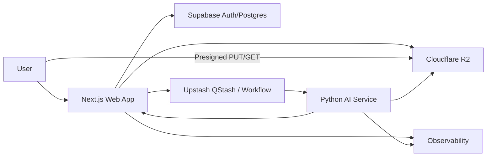
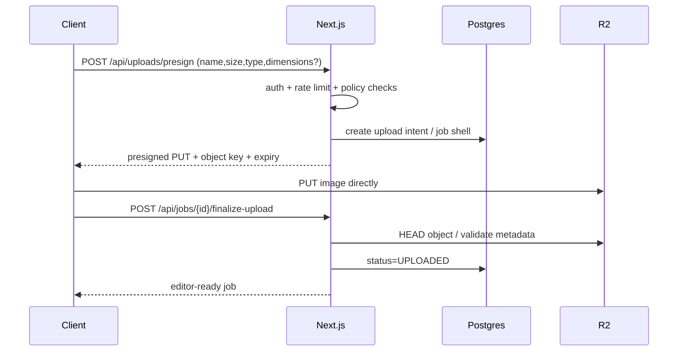
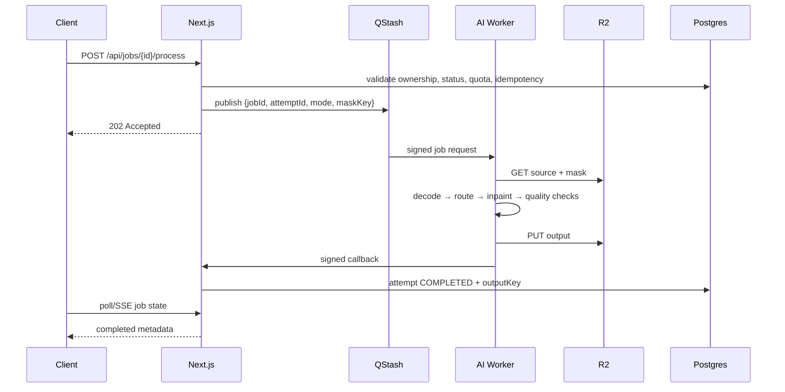
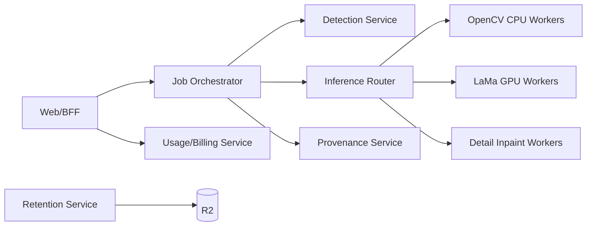

# 03 — System Architecture

**Project:** Watermark Removal Platform (working name: CleanMark)  
**Document version:** 1.0  
**Prepared:** 2026-09-08  
**Status:** Architecture / implementation blueprint  

> **Purpose:** Defines C4-style system boundaries, runtime topology, state flow and architecture principles.

> Product boundary: the platform is designed for images the user owns or is authorized to modify. It does not intentionally remove hidden provenance, C2PA Content Credentials, or other non-visible rights-management information.

---

## 1. Context diagram



## 2. Container responsibilities

### `web`

- Rendering and navigation.
- Authentication/session handling.
- Authorization/entitlements.
- Upload ticket generation.
- Job creation.
- Queue publishing.
- Job status APIs.
- Output download authorization.
- User history/settings.
- Admin metadata interfaces.
- Provenance inspection/signing adapter where supported.

### `ai-worker`

- Source object fetch.
- Decode and sanitize.
- Candidate detection.
- Mask refinement.
- Inpainting routing.
- Artifact checking.
- Output composition/encoding.
- Output object upload.
- Callback/status update.

### Supabase

- users/profiles.
- jobs and attempts.
- watermark candidates metadata.
- usage ledger.
- policy acknowledgements.
- abuse events.
- feature flags/model configs — or a separate configuration store later.

### R2

Private buckets or private prefixes for:

```text
originals/{userScope}/{jobId}/source.ext
previews/{userScope}/{jobId}/preview.webp
masks/{userScope}/{jobId}/{maskVersion}.png
outputs/{userScope}/{jobId}/{attemptId}.{ext}
provenance/{userScope}/{jobId}/manifest.json  # optional derived metadata only
```

## 3. Upload flow



Do not treat client-reported file size/type as authoritative. Verify object metadata and decode it in the worker before inference.

## 4. Processing flow



## 5. State machine

```text
CREATED
  ↓
UPLOAD_PENDING
  ↓
UPLOADED
  ├──→ DETECTING → MASK_READY
  │                    ↓
  └────────────────→ QUEUED
                         ↓
                    PROCESSING
                         ↓
                   POST_PROCESSING
                     ↙        ↘
                 COMPLETED    FAILED
                     ↓          │
                  EXPIRED ←─────┘ (after retention where applicable)

Any non-terminal state → DELETED
```

Transitions are server-enforced. Client UI may optimistically display intent but cannot directly set authoritative status.

## 6. Architecture principles

1. **Object storage is the media bus.** Services exchange object keys, not image bytes.
2. **Every expensive operation is idempotent.** `(jobId, attemptId, operation)` uniquely identifies work.
3. **Model versions are immutable identifiers.** Every attempt records detector/inpainter/config version.
4. **Preserve originals.** Never mutate the original object.
5. **Fail closed on authorization.** A worker must not process a job without a valid signed internal request and authorized job state.
6. **No hidden coupling through UI state.** Backend state can reconstruct the job after refresh.
7. **Provider abstraction.** Storage, queue and inference implementations sit behind interfaces.
8. **Observable stage boundaries.** Track decode, detection, segmentation, inpainting, encoding and upload separately.

## 7. Availability strategy

V1 target can be modest, but design for recovery:

- QStash retry + DLQ.
- Worker callback idempotency.
- Reconciliation job checks stale `PROCESSING` attempts.
- R2 lifecycle cleanup plus DB cleanup job.
- User can safely retry a failed attempt without re-uploading while source exists.

## 8. Region strategy

Choose regions to minimize **DB ↔ web** and **worker ↔ object storage** latency. Avoid copying full-resolution images through the web region. If processing expands globally, route inference by source-object locality only after benchmarking; do not prematurely build multi-region database writes.

## 9. Future scaled topology



Only evolve here when data justifies it.
