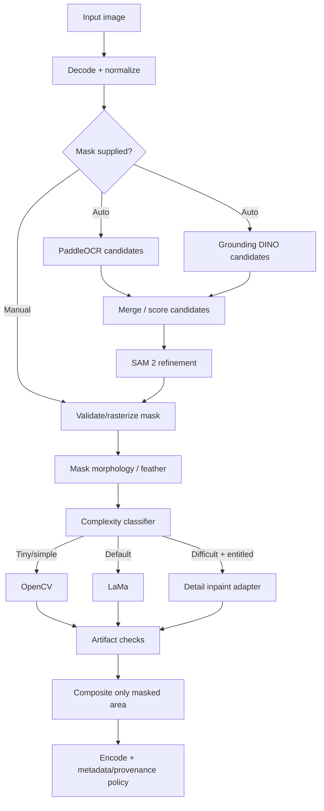

# 06 — AI/ML Pipeline

**Project:** Watermark Removal Platform (working name: CleanMark)  
**Document version:** 1.0  
**Prepared:** 2026-09-08  
**Status:** Architecture / implementation blueprint  

> **Purpose:** Specifies detection, segmentation, inpainting, quality routing, dataset strategy and model evaluation.

> Product boundary: the platform is designed for images the user owns or is authorized to modify. It does not intentionally remove hidden provenance, C2PA Content Credentials, or other non-visible rights-management information.

---

## 1. Core truth

When an opaque watermark covers pixels, the original hidden pixels are no longer available to the system. “Removal” means **masking the overlay and reconstructing a plausible region** from surrounding visual context. Product copy must not imply exact recovery.

## 2. Pipeline overview



## 3. Preprocessing

1. Verify file can actually be decoded.
2. Apply EXIF orientation to pixel data.
3. Convert processing copy to a supported RGB/RGBA color space.
4. Preserve ICC information needed for final color fidelity where practical.
5. Detect extremely large/decompression-bomb dimensions.
6. Generate preview separately from original.
7. Never overwrite the source object.

## 4. Manual mask

This is the V1 reliability anchor.

Mask convention:

- white/non-zero = pixels allowed to change
- black = pixels that must remain original

Recommended mask processing:

- remove tiny isolated accidental components;
- configurable dilation 0–8 px at image scale;
- feather edge 0–8 px for compositing;
- preview mask remains editable.

## 5. OCR candidate detection

Use PaddleOCR text detection; recognition can be optional.

Run candidate passes on carefully selected transforms only when needed:

- original
- grayscale/contrast-normalized
- inverted/luma variants for light text

Merge overlapping boxes via IoU/containment rules. Avoid running many expensive transforms on every image before a fast first pass.

## 6. Visual candidate detection

Grounding DINO prompt set can begin with:

```text
watermark . logo . text overlay . signature . brand mark .
```

Tune thresholds on your own benchmark. These outputs are proposals, not ground truth.

## 7. Segmentation

Pass candidate box/point prompts into SAM 2. Allow:

- positive points
- negative points
- bounding box
- mask refinement

Store candidate mask separately from user-edited authoritative mask.

## 8. Repeating watermark detection

Phase 4+ approach:

1. OCR/edge candidate extraction.
2. Normalize candidate crops.
3. Cluster by visual/text similarity.
4. Detect periodic/diagonal layout.
5. Create union mask.
6. Let user deselect false positives before processing.

A custom watermark segmentation model will eventually outperform hand-composed heuristics for this class.

## 9. Inpainting router

### Engine A — OpenCV Telea/Navier-Stokes

Candidate rule starting point (must be benchmarked):

- mask ratio under ~0.3–0.5%;
- local background low-frequency or structurally simple;
- no face/eye/textured semantic region detected.

### Engine B — LaMa

Default for most masks. Keep a stable pinned model artifact with checksum/version.

### Engine C — detail/generative adapter

Use only if:

- user selected Detail quality or fallback is allowed;
- mask overlaps high-complexity semantic structures;
- account entitlement/budget allows it.

Wrap model/provider behind:

```python
class InpaintProvider(Protocol):
    def inpaint(self, image, mask, options) -> InpaintResult: ...
```

## 10. Tile strategy for high-resolution images

For images larger than model-friendly dimensions:

1. Expand a crop around mask bounding box with context margin.
2. Process only affected crop if feasible.
3. For very large/repeating masks, tile with overlap.
4. Blend tiles carefully.
5. Composite result into full-resolution original.

Avoid downscaling the whole image and upscaling it back unless the user explicitly chooses reduced output.

## 11. Artifact checks

Automated checks can include:

- output dimensions unchanged;
- alpha channel validity;
- NaN/invalid pixel check;
- unexpected global histogram change outside mask;
- outside-mask pixel-difference threshold;
- seam score around mask boundary;
- optional face/edge structural anomaly classifier later.

If quality guard fails, mark attempt `QUALITY_REVIEW_FAILED` internally and either route fallback or return a clear retry option.

## 12. Custom watermark segmentation model

### Synthetic dataset generation

Use owned, CC0 or clearly licensed clean images. Overlay generated marks with known masks:

- text
- logos from synthetic/open assets
- repeated diagonal patterns
- rotations
- scale
- opacity
- blur
- blend modes
- stroke/shadow
- compression artifacts
- perspective transforms
- multiple watermarks

Because the overlay is generated, the exact segmentation mask is known.

### Dataset split

Keep source images disjoint across train/validation/test to prevent leakage.

### Metrics

- pixel precision/recall/F1
- IoU
- false-positive area ratio
- candidate-level recall
- calibration error for confidence

## 13. Inpainting benchmark dataset

Build three sets:

1. **Synthetic paired:** clean image + overlay + exact clean ground truth.
2. **Owned real:** real authorized watermark images with human quality scoring.
3. **Adversarial:** thin hair, faces, skin, gradients, typography, complex fabric, transparent edges, repeating marks.

Metrics:

- SSIM
- PSNR
- LPIPS
- outside-mask preservation
- seam score
- human preference rating
- failure taxonomy

## 14. Model registry metadata

```text
model_id
family
version
artifact_sha256
license
source_url
runtime
precision
device_requirements
created_at
approved_for_production
benchmark_version
```

## 15. License control

Never assume a library license automatically covers model weights. Keep a `MODEL_LICENSES.md` registry and review each checkpoint/dependency before commercial deployment. The research baseline found Apache-2.0 licensing for official SAM 2, Grounding DINO and PaddleOCR repositories; LaMa/IOPaint should still be re-verified at the exact commit/model artifact used.
