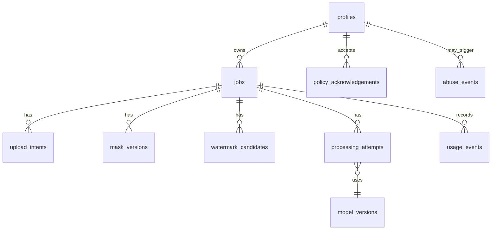

# 07 — Data Model and Database

**Project:** Watermark Removal Platform (working name: CleanMark)  
**Document version:** 1.0  
**Prepared:** 2026-09-08  
**Status:** Architecture / implementation blueprint  

> **Purpose:** Defines Postgres entities, relationships, indexes, RLS concepts and immutable audit/usage records.

> Product boundary: the platform is designed for images the user owns or is authorized to modify. It does not intentionally remove hidden provenance, C2PA Content Credentials, or other non-visible rights-management information.

---

## 1. Database principles

- Postgres stores metadata, never image blobs.
- R2 object keys are opaque internal references.
- Attempts are immutable historical records except lifecycle fields.
- Job status follows server-controlled transition rules.
- Sensitive internal errors are separated from user-visible messages.
- RLS protects all user-scoped tables.

## 2. Entity relationship overview



## 3. `profiles`

```sql
id uuid primary key references auth.users(id)
display_name text null
plan text not null default 'free'
history_enabled boolean not null default true
created_at timestamptz not null
updated_at timestamptz not null
```

Do not duplicate email if Supabase Auth already owns it unless there is a concrete business requirement.

## 4. `jobs`

```sql
id uuid primary key
user_id uuid null
anonymous_session_hash text null
status job_status not null
source_object_key text not null
preview_object_key text null
active_mask_version_id uuid null
active_attempt_id uuid null
source_filename text null
source_mime text not null
source_bytes bigint not null
source_width int null
source_height int null
authorization_policy_version text not null
expires_at timestamptz not null
created_at timestamptz not null
updated_at timestamptz not null
deleted_at timestamptz null
```

For anonymous jobs, use a secure opaque browser/session token mapped server-side; do not rely only on IP address.

## 5. `upload_intents`

```sql
id uuid primary key
job_id uuid not null
object_key text not null
expected_mime text not null
expected_max_bytes bigint not null
expires_at timestamptz not null
completed_at timestamptz null
created_at timestamptz not null
```

## 6. `mask_versions`

```sql
id uuid primary key
job_id uuid not null
version int not null
object_key text not null
source text not null -- manual, sam2, auto, edited
width int not null
height int not null
mask_area_ratio numeric null
created_at timestamptz not null
unique(job_id, version)
```

## 7. `watermark_candidates`

```sql
id uuid primary key
job_id uuid not null
candidate_type text not null
source text not null
confidence numeric not null
bbox jsonb not null
mask_object_key text null
selected boolean not null default false
model_version_id uuid null
created_at timestamptz not null
```

## 8. `processing_attempts`

```sql
id uuid primary key
job_id uuid not null
attempt_no int not null
status attempt_status not null
mode text not null
input_mask_version_id uuid not null
output_object_key text null
output_mime text null
output_bytes bigint null
engine text null
provider text null
model_version_id uuid null
queue_message_id text null
idempotency_key text not null
started_at timestamptz null
completed_at timestamptz null
error_code text null
user_error_message text null
internal_error_fingerprint text null
metrics jsonb null
created_at timestamptz not null
unique(job_id, attempt_no)
unique(idempotency_key)
```

## 9. `usage_events`

Append-only ledger:

```sql
id uuid primary key
user_id uuid null
job_id uuid null
attempt_id uuid null
event_type text not null
quantity numeric not null
unit text not null -- image, gpu_second, megapixel, credit
metadata jsonb null
created_at timestamptz not null
```

Do not compute billing from mutable counters only. Counters can be cached projections of this ledger.

## 10. `policy_acknowledgements`

```sql
id uuid primary key
user_id uuid null
anonymous_session_hash text null
job_id uuid not null
policy_type text not null
policy_version text not null
accepted_at timestamptz not null
```

## 11. `model_versions`

```sql
id uuid primary key
family text not null
version text not null
provider text not null
artifact_sha256 text null
license_spdx text null
source_url text null
benchmark_version text null
production_approved boolean not null default false
created_at timestamptz not null
unique(family, version, provider)
```

## 12. `abuse_events`

Store signals, not unsupported accusations:

```sql
id uuid primary key
user_id uuid null
job_id uuid null
signal_code text not null
action_taken text null
metadata jsonb null
created_at timestamptz not null
reviewed_at timestamptz null
```

## 13. Indexes

```sql
create index jobs_user_created_idx on jobs(user_id, created_at desc);
create index jobs_status_updated_idx on jobs(status, updated_at);
create index jobs_expiry_idx on jobs(expires_at) where deleted_at is null;
create index attempts_job_created_idx on processing_attempts(job_id, created_at desc);
create index attempts_status_started_idx on processing_attempts(status, started_at);
create index usage_user_created_idx on usage_events(user_id, created_at desc);
```

## 14. RLS concepts

- User can select their own jobs.
- Anonymous jobs are not directly queryable through public Supabase APIs; access via BFF only.
- User cannot update `status`, `output_object_key`, model fields or usage ledger directly.
- Service-role access exists only on trusted server.
- Admin access uses explicit admin role/claims and server-side endpoints.

## 15. Retention

Recommended defaults:

- Anonymous source: ~1 hour after last active use.
- Anonymous output: up to 24 hours.
- Signed-in free history: configurable 24–72 hours initially.
- Paid history: product decision, e.g. 7/30 days.
- Usage/audit metadata may be retained longer without image content according to privacy policy.

All durations must be configuration, not magic numbers in code.
